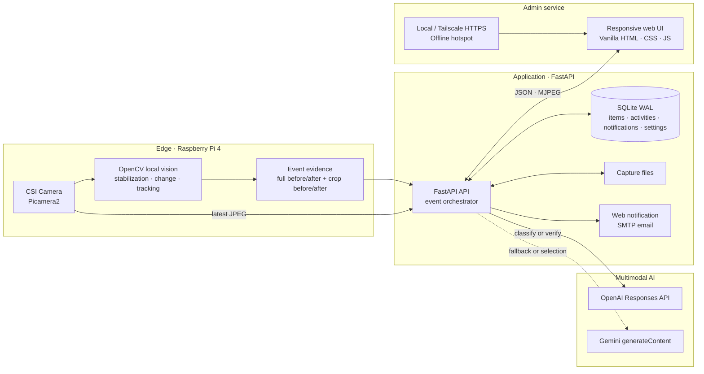
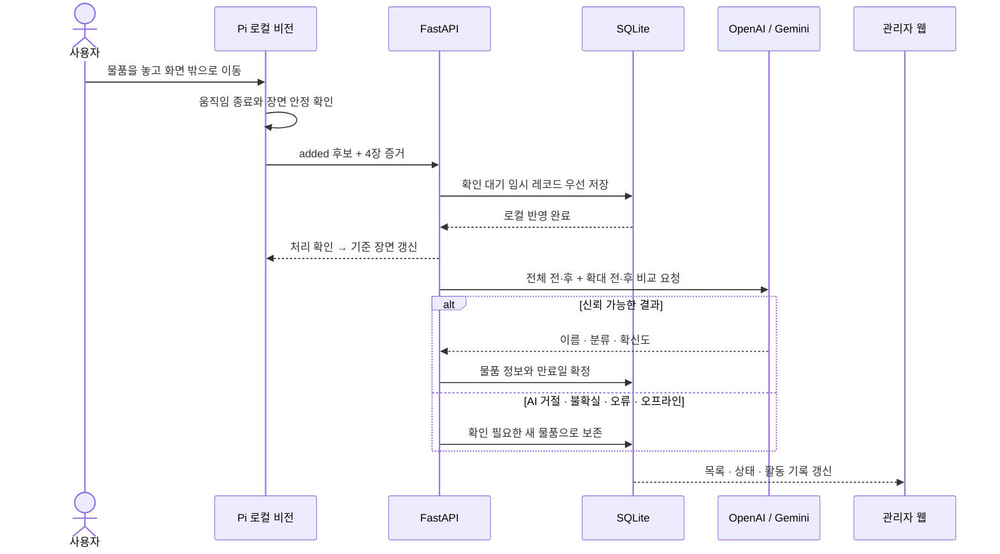

# Re:Found — 분실물 자동 추론 및 시각화 관리 AI 시스템

**무엇부터 볼지 찾는다면 [여기서 시작하세요](START_HERE.md).** Pi 시연 준비 재개 / 논문 / 발표 PPT 제작 경로와 현재 진행 상태를 한 장에 정리했습니다.

### 2026 AI 캡스톤디자인 · 동양미래대학교 인공지능소프트웨어학과 · 상부상조(2조)

| 학번 | 이름 | 역할 | 현재 담당 영역 |
|---|---|---|---|
| 20241499 | **장진석** | 팀장 · 시스템 통합 | 기획 및 아키텍처, 로컬 비전·멀티모달 AI·FastAPI·관리자 웹 구현, Raspberry Pi 배포, 테스트 및 문서화 |
| 20241516 | **권기원** | 팀원 · 개발/시연 지원 | 구현 및 발표 자료 검토, 자료 교정, 시연 준비와 운영 지원 |

> Raspberry Pi 엣지 비전과 멀티모달 AI를 결합해 분실물의 **감지 · 분류 · 보관 · 알림 · 회수**를 하나의 관리자 서비스로 연결합니다.

`EDGE VISION × MULTIMODAL AI × LIFECYCLE MANAGEMENT`

## 프로젝트 개요 및 최종 목표

| 구분 | 현재 기준 내용 |
|---|---|
| 프로젝트명 | 분실물 자동 추론 및 시각화 관리 AI 시스템 `Re:Found` |
| 교과목 | 2026 AI 캡스톤디자인 |
| 소속 | 동양미래대학교 인공지능소프트웨어학과 |
| 팀 | 상부상조(2조) |
| 지도교수 | 강환수 교수 |
| 최종 산출물 | Raspberry Pi 카메라 장치, FastAPI 서버, 반응형 관리자 웹으로 구성된 통합 프로토타입 |

고정 카메라의 장면 변화를 로컬에서 감지하고, 사건이 안정된 시점에 변경 전·후 전체 장면과 변화 영역 확대 이미지를 OpenAI 또는 Gemini의 멀티모달 API가 함께 비교합니다. 새 물품은 AI가 열린 범주의 이름과 분류를 추론하며, 등록 이후에는 보관 기한·알림·회수·폐기·복원까지 동일한 시스템에서 관리합니다.

이 프로젝트의 최종 목표는 단순한 객체 인식 데모가 아니라, **인식 결과가 실제 분실물 관리 업무의 끝까지 이어지는 실행 가능한 서비스**를 만드는 것입니다. API 키나 카메라를 사용할 수 없는 상황에서도 내장 시연 데이터로 관리자 흐름을 확인할 수 있도록 구성했습니다.

### 보관 분류 정책

| 분류 | 예시 | 기본 보관 기한 |
|---|---|---:|
| 고가품 | 휴대전화, 노트북, 지갑, 귀금속 | 90일 |
| 일반 물품 | 우산, 의류, 필기구 | 60일 |
| 음식 | 도시락, 음료, 부패 가능한 내용물 | 1일 |

`1일 · 60일 · 90일`은 법정 보관 기간이 아니라 현재 프로토타입의 기본 운영 정책입니다. 관리자는 물품별 분류와 만료일을 수정하거나 기한을 연장할 수 있습니다.

## 빠른 링크

**microSD 고장 후 새로 설치한다면 [새 SD 시작 안내](docs/guides/FRESH_SD_START.md)부터 따라갑니다.** 기본 배포 파일은 `dist/refound-pi.tar.gz`이며, [실기 확인표](docs/guides/PI_ACCEPTANCE_CHECKLIST.md)로 재부팅까지 확인한 뒤 논문·발표 작업으로 이어갑니다.

**2026-09-30 갱신:** 새 SD 설치·카메라·기본 실물 흐름·재부팅의 9월 22일 확인에 이어, 현재는 **Windows 노트북의 `ReFoundLaptop` 핫스팟 → Pi → 같은 노트북의 SSH 터널**을 사용합니다. 9월 29일 Pi Wi-Fi 연결 활성화 로그와 노트북 웹 화면·OpenAI API 동작의 사용자 성공 보고가 있습니다. 새 구성의 자동 연결 설정 결과, 정상 종료 후 전원 재인가·무선 단독 부팅·화면/영상/AI 복귀는 아직 미확인입니다. 친구 Tailscale 수락·접속도 미확인이며 현재 SSH 방식의 선행 조건은 아닙니다. [매번 실행·종료하는 순서](REFOUND_WINDOWS_HOTSPOT_GUIDE.md)와 [작업 인계](docs/SESSION_HANDOFF_2026-09-18.md)를 따릅니다. Pi 화면만 여는 노트북에는 앱 설치가 필요 없습니다.

| 구분 | 링크 |
|---|---|
| 전체 문서 인덱스 | [docs/README.md](docs/README.md) |
| 팀 프로젝트 기획서 | [docs/팀 프로젝트기획서.pdf](<docs/팀 프로젝트기획서.pdf>) |
| 핵심 개념 증명 | [docs/01 캡스톤 개념 증명.pdf](<docs/01 캡스톤 개념 증명.pdf>) |
| API 토큰·비용 예측 자료 | [docs/02 캡스톤 API 토큰 및 가격 예측.pdf](<docs/02 캡스톤 API 토큰 및 가격 예측.pdf>) |
| 회의록 | [docs/Meeting_Minutes](docs/Meeting_Minutes) |
| 현재 발표 준비 | [발표 방향·개선점·검증 근거](docs/IMPROVEMENTS.md) |
| 과거 프로젝트 발표 원고 | [8월 16일 발표 초안 — 재검토 후 활용](docs/presentation/PRESENTATION.md) |
| Raspberry Pi 설치·운영 | [Raspberry Pi 초보자 가이드](docs/guides/RASPBERRY_PI_GUIDE.md) |
| 새 SD 재설치·첫 접속 | [짧은 설치 순서](docs/guides/FRESH_SD_START.md) |
| 실기 확인·다음 세션 | [결과·확인표](docs/guides/PI_ACCEPTANCE_CHECKLIST.md) · [9월 30일 갱신 인계](docs/SESSION_HANDOFF_2026-09-18.md) |
| 학교 시연 절차 | [현재 Windows 핫스팟·SSH 실행/종료](REFOUND_WINDOWS_HOTSPOT_GUIDE.md) · [Android/Tailscale 대안](docs/guides/SCHOOL_DEMO_GUIDE.md) |
| 발표용 Mermaid 도식 | [도식 목록 및 다운로드 안내](docs/presentation/diagrams/README.md) |
| Mermaid 원본 묶음 | [refound-mermaid-diagrams.zip](docs/presentation/refound-mermaid-diagrams.zip) |

## 시스템 구성도



평상시 프레임 분석과 사건 후보 생성은 Raspberry Pi 내부에서 수행합니다. 외부 AI에는 모든 프레임이 아니라 변화가 확정된 사건의 전·후 전체 장면과 전·후 확대 영역, 총 4장의 증거 이미지만 요청 단위로 전송합니다.

## 주요 기능 정의 및 구현 현황

| 영역 | 현재 구현 | 상태 |
|---|---|---|
| 카메라 입력 | Picamera2/OpenCV 입력, MJPEG 실시간 화면, 합성 시연 카메라 | 구현 |
| 로컬 사건 감지 | 장면 정합, 움직임·안정화 확인, 변화 영역 산출 | 구현 |
| 물품 이동 추적 | 동일 물품의 위치 변경 시 새 ID를 만들지 않고 좌표·참조 이미지 갱신 | 구현 |
| 신규 물품 등록 | AI 응답 전에 임시 레코드를 먼저 저장하고 이후 이름·분류 확정 | 구현 |
| 사건 전달 확인 | DB 반영 성공 후 기준 장면 갱신, 실패 사건만 재시도, 지연 사건의 revision 검사 | 구현 |
| 감지 검토 | 확인 필요 목록, 명시적 확인, 증거를 보존하는 감지 제외·복원 | 구현 |
| 멀티모달 분류 | OpenAI 우선, Gemini 선택/대체 사용, 낮은 확신도 보존 | 구현 · 실제 키별 검증 필요 |
| 생명주기 관리 | 보관, 기한 도래, 회수, 폐기, 복원, 기한 연장 | 구현 |
| 알림 | 웹 알림과 SMTP 만료 메일 | 구현 · 실제 메일 계정 검증 필요 |
| 관리자 웹 | 대시보드, 보관 물품, 활동 기록, 카메라, 설정 | 구현 |
| 배포·접속 | systemd 자동 시작, Tailscale 비공개 HTTPS, 오프라인 핫스팟 | 구현 · 현장 리허설 필요 |
| 안전장치 | 개인정보 보호 모드, 일반 초기화 전 자동 백업, 시연 초기화 확인, 중복 작업 방지 | 구현 |

### 핵심 처리 흐름



물품이 화면 안에서 이동한 경우에는 로컬 추적 결과로 기존 ID의 위치를 갱신해 불필요한 외부 호출을 줄입니다. 물품 제거는 저장된 빈 배경과의 일치도가 충분하면 로컬에서 회수 처리하고, 모호한 경우에만 멀티모달 AI 검증을 사용할 수 있습니다.

회수 상태는 카메라에서 사라짐 또는 관리자의 회수 처리를 뜻하며, 실제 소유자에게 반환됐음을 증명하지는 않습니다. AI가 새 물품이 아니라고 판단해도 관찰과 사진은 보존합니다. 관리자는 확인 필요 목록에서 정보를 확인하거나 잘못된 감지를 제외·복원할 수 있습니다. 목록 검색과 정렬은 전체 DB를 대상으로 하며 한 페이지에 48개씩 표시합니다.

## 데이터 및 AI 모델 설계

| 항목 | 현재 설계 |
|---|---|
| 데이터 입력 | 고정 카메라의 연속 프레임과 사건 시점의 4장 이미지 |
| 로컬 전처리 | 프레임 정합, 픽셀 차이, 모폴로지 처리, 연결 성분, bounding box, 안정화 |
| AI 입력 | 전체 장면 전·후는 문맥용 저해상도, crop 전·후는 식별용 고해상도 |
| AI 출력 | `added` · `removed` · `uncertain`, 물품명, `valuable` · `general` · `food`, 확신도와 근거 |
| 저장 데이터 | SQLite의 물품·활동·알림·설정과 파일 시스템의 사건 이미지 |
| 실패 처리 | 키 없음, API 오류, 낮은 확신도에서도 임시 물품을 삭제하지 않고 관리자 확인 대상으로 유지 |
| 학습 방식 | 별도 커스텀 모델 학습 없이 사전학습 멀티모달 API의 구조화 추론 사용 |

현재 구현에는 별도의 학습·검증·테스트 데이터셋이나 커스텀 CNN이 없습니다. 따라서 자동화 테스트 통과 수치를 AI 분류 정확도로 해석하지 않으며, 모델 성능은 실제 카메라 환경에서 정답 라벨을 가진 사건 데이터셋을 구축한 뒤 별도로 평가해야 합니다.

발표 및 논문용 정량 평가는 다음 지표를 기준으로 수집할 계획입니다.

- 사건 감지 `precision · recall · F1`
- 고가품·일반·음식 분류 정확도와 혼동행렬
- 시간당 오검출 수와 불확실 판정 비율
- 감지부터 DB 반영까지의 `p50 · p95` 지연시간
- Raspberry Pi의 메모리 사용량, CPU 사용률과 온도
- OpenAI/Gemini별 정확도·지연시간·요청 비용 비교

## UI/UX 및 서비스 구조

| 화면/기능 | 사용자 목적 | 주요 UX 원칙 |
|---|---|---|
| 대시보드 | 실시간 화면, 보관 현황, 만료 예정, 최근 활동 확인 | 한 화면에서 현재 상태 파악 |
| 보관 물품 | 검색·필터, 상세 확인, 정보 수정, 회수·폐기·복원·연장 | 상태와 가능한 작업을 명확히 분리 |
| 활동 기록 | 자동 감지와 관리자 작업 이력 확인 | 사건 원인과 결과를 시간순으로 추적 |
| 카메라 | 실시간 스트림, 기준 장면 재설정, 시연 물품 추가 | 현장 문제를 즉시 복구할 수 있는 직접 피드백 |
| 설정 | 감지 민감도, 안정화 시간, AI 공급자, SMTP, 시스템 초기화 | 위험 작업 확인과 운영 설정의 중앙화 |

프론트엔드는 별도 빌드 과정이 없는 Vanilla HTML/CSS/JavaScript로 구성했습니다. 데스크톱과 태블릿에서 사용할 수 있는 반응형 관리자 화면이며, 상태 변경과 활동 기록은 같은 데이터베이스 트랜잭션으로 처리해 화면과 이력이 어긋나는 중간 상태를 줄였습니다.

## 초기 계획 대비 현재 변경사항

| 초기 계획 | 현재 구현 | 변경 목적 |
|---|---|---|
| Raspberry Pi 5 + USB 카메라 | Raspberry Pi 4 2GB + CSI 카메라 | 실제 보유 장비와 최종 배포 환경에 맞춤 |
| YOLOv8 + 커스텀 CNN + 로컬 LLM | OpenCV 사건 감지 + OpenAI/Gemini 멀티모달 추론 | 제한된 엣지 자원에서 열린 범주의 물품을 문맥과 함께 판단 |
| crop 단일 이미지 중심 | 전체 전·후 + crop 전·후 4장 증거 | 추가·제거 방향과 주변 문맥 손실 감소 |
| AI 결과 수신 후 등록 | 임시 레코드 우선 저장 후 비동기 분류 | API 장애·낮은 확신도에서도 감지 기록 보존 |
| AWS RDS(MySQL) | 로컬 SQLite WAL + 파일 저장소 | 오프라인 시연과 단일 장치 운영 단순화 |
| FastAPI와 Spring 병행 검토 | FastAPI 단일 백엔드 | 중복 계층 제거와 Python 비전 파이프라인 통합 |
| React 검토 | Vanilla HTML/CSS/JavaScript | Pi 배포와 유지보수에 필요한 빌드 복잡도 축소 |
| 음식 1일 · 비음식 30일 · 고가품 6개월 | 음식 1일 · 일반 60일 · 고가품 90일 | 현재 프로토타입 운영 정책으로 통일 |
| 외부 공개형 접속 검토 | 로컬 접속 + Tailscale 비공개 HTTPS + 오프라인 핫스팟 | 로그인 기능이 없는 시연 시스템의 노출 범위 제한 |

## 검증 현황과 다음 과제

2026-09-22 시연 초기화 변경 후 **Python 272개, 프런트엔드 Node 37개, Chromium 7개**가 통과했습니다. 이후 네트워크 안내·배포 변경에서는 배포 검사 6개와 패키지 47개 파일 대조를 완료했습니다. [앱 검사 요약](output/maintenance/2026-09-22-quick-reset/VALIDATION.json), [배포 당시 요약](output/maintenance/2026-09-22-network-plan/VALIDATION.json)을 보존했습니다. 이는 소프트웨어 회귀·배포 검증이며 실제 AI 정확도나 현장 감지율을 의미하지 않습니다.

앞선 9월 18일 운영 흐름 검사에서는 Python 264개·Node 33개와 별도 Chromium 데스크톱 12개·모바일 4개를 검증했습니다. 합성 카메라의 사건부터 API·DB 반영, 기한·알림·연장·폐기·복원, AI·메일 실패, 편집 충돌·연결 복구를 다뤘습니다. [운영 흐름 점검](docs/LIVE_FLOW_REVIEW_2026-09-18.md), [처리 구조 개선](docs/ARCHITECTURE_REVIEW_2026-09-18.md), [앱 개선](docs/APP_REVIEW_2026-09-18.md), [영상 개선](docs/VISION_REVIEW_2026-09-18.md)은 해당 시점 기록입니다.

9월 22일 새 Pi의 실제 촬영·재부팅 진단 로그와 초기화·등록·이동·회수·본인 PC HTTPS 화면/영상 성공 보고에 더해, 9월 29일 Windows 핫스팟 연결 로그·노트북 SSH 웹·OpenAI 동작 성공 보고를 [실기 확인표](docs/guides/PI_ACCEPTANCE_CHECKLIST.md)에 반영했습니다. 원격 AI의 세부 판정, 메일 수신과 현장 조건의 장시간 시험은 남아 있습니다. 현재 재개 지점은 **Windows 핫스팟의 자동 연결·무선 단독 전원 재인가 시험 또는 기존 발표 PPT 보완**입니다.

9월 30일 Git 대량 반영 점검에서 기존 **Python 272개·Node 37개** 검사를 격리된 데이터로 재실행해 통과했습니다. 복사된 실행 소스는 9월 22일 설치 배포본과 일치했습니다. [저장소 점검 보고서](output/maintenance/2026-09-30-sync-review/REVIEW.md)에 검증 범위와 Git 관리상 남은 항목을 기록합니다. 실제 Pi·원격 AI·SMTP·브라우저 실기는 이번에 재실행하지 않았습니다.

아래는 이후 선택할 장기 개선·연구 후보이며 자동으로 시작할 작업 목록은 아닙니다.

1. 교실 조명, 가림, 겹침, 초점 변화가 포함된 실제 사건 데이터 수집과 정답 라벨링
2. 동일 데이터에서 OpenAI와 Gemini의 정확도·지연시간·비용 비교
3. Raspberry Pi 장시간 실행 시 메모리·CPU·온도와 카메라 안정성 측정
4. Windows 노트북 핫스팟과 SSH 터널을 사용하는 발표 당일 리허설. Android/Tailscale은 별도 대안
5. 실제 운영으로 확장할 경우 로그인·권한 관리, 촬영 고지, 얼굴·문서 마스킹과 보존 정책 추가

## 발표용 Mermaid 원본

각 `.mmd` 파일은 [Mermaid Live Editor](https://mermaid.live/)에 붙여 넣어 SVG 또는 PNG로 내려받을 수 있습니다.

| 도식 | Mermaid 원본 |
|---|---|
| 시스템 구성도 | [01-system-architecture.mmd](docs/presentation/diagrams/01-system-architecture.mmd) |
| 주요 기능 정의 | [02-core-features.mmd](docs/presentation/diagrams/02-core-features.mmd) |
| 데이터 및 AI 모델 설계 | [03-data-ai-design.mmd](docs/presentation/diagrams/03-data-ai-design.mmd) |
| UI/UX 및 서비스 구조 | [04-uiux-service-structure.mmd](docs/presentation/diagrams/04-uiux-service-structure.mmd) |
| 데이터 모델 | [05-data-model.mmd](docs/presentation/diagrams/05-data-model.mmd) |
| 전체 도식 한 파일 | [all-diagrams.md](docs/presentation/diagrams/all-diagrams.md) |

---

## 실행 및 운영 가이드

### 1. 가장 빠른 실행법 (Windows PowerShell)

Python 3.11 이상을 설치한 다음 이 폴더에서 실행합니다.

```powershell
.\setup.ps1
.\start.ps1
```

브라우저에서 <http://127.0.0.1:8000>을 엽니다. PowerShell 실행 정책 때문에 스크립트 실행이 차단되면 아래 명령으로 동일하게 실행할 수 있습니다.

```powershell
python -m venv .venv
.\.venv\Scripts\python.exe -m pip install -r requirements.txt
Copy-Item .env.example .env
.\.venv\Scripts\python.exe run.py
```

메일 중복 방지는 단일 서버 프로세스를 기준으로 설계되어 있습니다. 제공된 `start.ps1` 또는 `run.py`로 실행하고, `uvicorn --workers 2`처럼 여러 worker를 띄우지 마세요.

#### Raspberry Pi 4 + 카메라 모듈

새 설치는 [새 SD 시작 안내](docs/guides/FRESH_SD_START.md)의 **OS → 설치 → SSH 터널 실물 확인** 순서로 진행합니다. 카메라 연결, 자동 시작, Tailscale과 선택적 `ReFound-Demo` 전용 Wi-Fi의 자세한 설명은 [Raspberry Pi 초보자 가이드](docs/guides/RASPBERRY_PI_GUIDE.md)에 있습니다.

설치와 Tailscale 설정을 이미 끝냈다면 [Android 핫스팟 학교 시연 운영 가이드](docs/guides/SCHOOL_DEMO_GUIDE.md)에서 지금 상태에 이어 핫스팟 저장, 냉간 부팅 리허설, 발표 당일 순서와 OpenAI/Gemini 전환 방법만 따라가면 됩니다.

핫스팟을 미리 저장하지 못한 상태로 학교에 가더라도 별도 모니터와 USB 키보드가 있다면 [Pi 모니터·키보드 현장 Wi-Fi 연결 가이드](docs/guides/PI_MONITOR_WIFI_GUIDE.md)를 따라 현장에서 직접 로그인하고 연결할 수 있습니다.

- 평상시와 학교 시연의 기본 경로: **Tailscale** — Pi와 노트북이 서로 다른 Wi-Fi에 연결되어도 양쪽에 인터넷만 있으면 접속할 수 있습니다.
- 인터넷도 확신할 수 없는 경우: **Pi 오프라인 핫스팟** — 노트북을 Pi가 만든 Wi-Fi에 직접 연결해 `http://10.42.0.1:8000`을 엽니다. 이때 웹과 로컬 감지는 동작하지만 OpenAI/Gemini와 메일은 인터넷이 없어 사용할 수 없습니다.
- 공유기 포트포워딩으로 8000번 포트를 인터넷에 직접 공개하지 마세요. 현재 앱은 단일 관리자 캡스톤 시연을 전제로 하며 자체 로그인 기능은 없습니다.

### 2. 시연 전 권장 설정

1. 웹캠을 삼각대나 모니터에 단단히 고정하고, 물건을 놓는 영역이 화면 중앙에 오게 합니다.
2. 관리자 웹의 **설정**에서 카메라 번호를 확인하고, 픽셀 변화 민감도는 우선 권장 범위인 `18~28`로 둡니다.
3. 사람이 화면 밖으로 완전히 빠진 뒤 장면이 안정되도록 `감지 후 대기`를 3~5초로 둡니다.
4. 감시 구역에서 기존 물건을 **완전히 모두 치운 뒤** 화면의 **기준 장면 다시 잡기**를 누릅니다. 처음 기준선에 남아 있던 물건은 나중에 사라질 때 오인될 수 있습니다.
5. 물건을 한 번에 하나만 놓고 손과 몸이 화면 밖으로 완전히 빠지게 합니다. 움직임 → 안정화 → 전체 장면과 변화 영역 AI 비교 → 등록 순서로 처리됩니다.
6. **보관 물품 → 확인 필요**에서 이름과 사진을 확인합니다. 실제 물품이면 ‘확인하고 저장’, 물품이 아닌 변화이면 ‘감지 제외’를 선택합니다. 제외해도 사진과 이력은 남으며 해당 목록에서 복원할 수 있습니다. 일반 정보 저장·기한 변경은 확인 필요 상태를 자동으로 해제하지 않습니다.
7. 카메라를 건드리지 않은 채 같은 물건을 완전히 치우고 화면 밖으로 나옵니다. 저장된 위치와 전후 장면을 비교해 회수 상태로 전환됩니다. 물건을 옆으로 조금 밀면 새 물건을 만들지 않고 기존 ID의 추적 위치를 갱신합니다.

발표 장소의 카메라 권한이나 네트워크가 불안정할 수 있으므로, 발표 직전에는 **시연 물품 추가** 버튼으로 `스마트폰(90일) → 샌드위치(1일) → 우산(60일)`이 정상 표시되는지도 확인하세요. 이 흐름은 인터넷 없이 동작합니다.

### 3. 멀티모달 AI 연결

`.env`에서 한 가지 이상을 설정합니다. 둘 다 설정하고 공급자를 `자동 선택`으로 두면 OpenAI를 우선 시도하고 실패 시 Gemini를 사용합니다.

```dotenv
OPENAI_API_KEY=여기에_키
GEMINI_API_KEY=여기에_키
```

키를 바꾼 뒤에는 서버를 재시작합니다. 분석 요청 한 번에 ① 변경 전 전체 장면, ② 변경 후 전체 장면을 저해상도 문맥 이미지로, ③ 변화 영역의 변경 전·후 확대 이미지를 고해상도 세부 이미지로 함께 보냅니다. 전체 장면은 물건의 위치와 추가·제거 방향을 판단하고, 확대 이미지는 종류와 특징을 식별하는 데 사용합니다.

원격 AI가 `added`로 판단하고 설정한 최소 확신도(기본 50%) 이상이면 이름과 분류를 확정합니다. `removed`, `uncertain`, 낮은 확신도·오류·오프라인에서는 기록과 사진을 보존하고 관리자 확인 대상으로 남습니다. 감지 제외는 관리자가 명시적으로 결정합니다. 분석 상태는 제공자와 별도의 필드로 관리합니다.

- OpenAI 모델·이미지 입력: <https://developers.openai.com/api/docs/models>
- Gemini 모델·이미지 입력: <https://ai.google.dev/gemini-api/docs/models>

기본 모델은 짧은 물품 분류의 비용과 응답 속도를 고려해 OpenAI `gpt-5.6-luna`, Gemini `gemini-3.5-flash-lite`로 지정되어 있습니다. 모델 ID는 관리자 설정에서 바꿀 수 있습니다.

### 4. 기한 메일 연결

관리자 웹 **설정**에 SMTP 서버, 포트, 발신 계정, 관리자 수신 메일을 입력하고 `.env`에 비밀번호를 둡니다.

```dotenv
SMTP_PASSWORD=메일_앱_비밀번호
```

Gmail 기준 서버는 `smtp.gmail.com`, 포트는 `587`, TLS는 켬입니다. Google 계정의 일반 비밀번호 대신 2단계 인증에서 만든 앱 비밀번호를 사용하세요. 설정 화면의 **테스트 메일 보내기**로 검증할 수 있습니다.

서버는 기한을 주기적으로 확인합니다. 기한이 지나면 물품을 `기한 도래`로 바꾸고 웹 알림을 항상 남기며, SMTP가 완전히 설정된 경우 관리자에게 메일을 한 번 보냅니다.

### 5. 감지 원리

```text
고정 기준 장면
    ↓ 미세 평행 이동·회전·초점 변화 보정 후 움직임 감지
사람이 빠질 때까지 대기 + 장면 안정 확인
    ↓ 이전 안정 장면과 차이 영역 계산
사건 ID와 관찰 당시 추적 revision으로 로컬 DB 반영
    ├ 성공 확인 → 기준 장면 갱신 (실패하면 기준 유지·재시도)
    ├ 기존 물품 이동 → 기존 ID의 위치 갱신
    ├ 확실한 소실 → 회수, 모호하면 AI 제거 재검증
    └ 새 물품 → 비동기 AI 분류 → 확정 또는 관리자 확인
        AI 입력: 전체 장면 전·후(low detail) + crop 전·후(high detail)
```

최대 약 24px의 특징 기반 이동, 약한 회전·초점 변화를 기준 좌표에 맞춘 뒤 비교합니다. 등록 당시 물체와 빈 배경의 외곽 증거도 함께 사용하므로 휴대전화 화면이 켜지는 변화는 회수로 처리하지 않습니다. 24px보다 크게 카메라가 옮겨졌거나 각도가 크게 바뀌면 빈 구역에서 기준 장면을 다시 잡으세요. 화면 가장자리 약 4%는 렌즈·노출 오검출 방지를 위해 신규 물품 감지를 보수적으로 처리하므로 물건은 중앙 감시 영역에 놓는 것이 좋습니다.

### 6. 데이터와 개인정보

- SQLite DB: `data/lost_items.db`
- 감지 이미지: `data/captures/`
- 초기화 백업: `data/reset-backups/<UTC 시각>/`
- API 키/SMTP 비밀번호: `.env` (Git에서 제외됨)
- 개인 정보 보호 모드에서는 실시간 화면을 흐리게 표시할 수 있습니다.
- OpenAI 또는 Gemini를 사용하면 변화가 감지된 시점의 **전체 카메라 장면 전·후 이미지**와 변화 영역 확대 이미지가 해당 외부 서비스로 전송됩니다. 카메라는 분실물 보관대만 촬영하도록 고정하고 사람, 문서, 모니터, 출입구는 구도에서 제외하세요.
- **개인정보 보호 모드**는 화면 영상과 이후 감지 분석을 중단하며 재시작 후에도 유지됩니다. 켜기 전에 이미 접수된 callback·AI 분석 작업은 계속 처리될 수 있습니다.

기본 서버 주소는 같은 컴퓨터에서만 접속 가능한 `127.0.0.1`입니다. 교내망 공개가 필요하면 `.env`의 `HOST=0.0.0.0`으로 바꾸되, 실제 운영 전에는 로그인·HTTPS·방화벽을 추가하세요.

시연을 빠르게 다시 시작하려면 먼저 **카메라 감시 구역의 물건을 모두 치운 뒤**, **대시보드 → 시연 초기화 → 백업 없이 초기화**를 누릅니다. 확인 문구 입력 없이 확인 한 번으로 **모든 물품·활동·알림·캡처를 백업 없이 삭제**하고 기준 화면을 다시 잡습니다. 내장 예시뿐 아니라 실제 카메라로 등록한 데이터도 삭제되며 되돌릴 수 없습니다. 카메라·AI·메일 설정, API 키와 기존 백업은 유지됩니다. 감시가 재개되고 화면이 안정되면 다음 물품을 놓습니다. 진행 중인 카메라·알림 작업이 끝나지 않으면 삭제를 취소하고 안내하며, 자동으로 삭제를 재시도하지 않습니다.

복구용 백업이 필요하면 **설정 → 시스템 → 운영 데이터 초기화**를 사용합니다. SQLite와 캡처 이미지를 위 백업 폴더에 저장한 다음 비우며, 경고 확인 후 `초기화`를 직접 입력해야 실행됩니다. 두 방식 모두 물건을 남긴 채 초기화하면 그 물건이 기준 화면의 일부가 되어 나중에 치울 때 오인될 수 있습니다.

### 7. 프로젝트 구조

```text
app/                    FastAPI 서버, 저장소, AI·카메라·감지 로직
static/                 관리자 화면 JavaScript·CSS
templates/              관리자 화면 HTML
tests/                  API·저장소·서비스·영상 처리 자동 테스트
scripts/raspberry-pi/   Pi 설치, 서비스, 네트워크, 배포 스크립트
scripts/experiments/    Raspberry Pi 자원 계측 스크립트
experiments/            논문 실험 스키마, ablation, 사건 매칭과 지표 CLI
docs/                   설치·시연 가이드, 발표·캡스톤 문서
data/                   SQLite DB와 감지 이미지(실행 중 생성, Git 제외)
dist/                   Pi 배포 압축 파일(생성 산출물, Git 제외)
run.py                  애플리케이션 진입점
```

`app/main.py`가 API와 서비스 수명 주기를 조정하고, `store.py`는 SQLite, `vision.py`는 장면 변화와 물체 추적, `ai.py`는 OpenAI/Gemini 분류, `notifier.py`는 만료 알림을 담당합니다.

### 8. 테스트

개발·테스트 의존성을 설치합니다.

```powershell
.\.venv\Scripts\python.exe -m pip install -r requirements-dev.txt
```

```powershell
.\.venv\Scripts\python.exe -m pytest
```

기본 Python 테스트와 Node.js가 설치된 개발 환경에서의 프런트엔드 회귀 검사:

```powershell
python -m unittest discover -s tests -q
node --test tests/frontend/app.test.cjs
```

프런트엔드 검사는 별도 npm 패키지 없이 실행되며, 브라우저에서의 시각 검사는 별도로 수행합니다.

카메라·DB·외부 AI를 사용하지 않는 합성 영상 개발 벤치마크:

```powershell
python scripts/benchmarks/vision_pipeline.py --threads 1 --output output/vision-benchmark.json
```

실행한 컴퓨터의 연산 시간을 측정합니다. 실제 촬영 FPS나 현장 인식 정확도 측정은 아닙니다.

서버 실행 후 상태 확인:

```powershell
Invoke-RestMethod http://127.0.0.1:8000/api/health
```

자동 테스트는 저장소, API, 합성 카메라 장면, AI/메일 실패 처리를 검증합니다. 발표 전에는 실제 환경에서 아래 3가지를 한 번씩 별도로 확인하세요.

1. 사용할 웹캠으로 빈 기준 화면을 잡은 뒤 물건 추가와 회수가 각각 감지되는지
2. 설정한 OpenAI/Gemini 키로 실제 물품 이름이 표시되고, 일부러 가리킨 물품은 `확인 필요한 새 물품`으로 보존되는지
3. **테스트 메일 보내기**로 관리자 주소에 메일이 도착하는지

논문용 안정 이미지 쌍 ablation, 사건 원장 검증·집계, Raspberry Pi 자원 측정은 [논문 실험 실행 가이드](docs/paper/EXPERIMENT_GUIDE.md)를 따르세요. 자동 테스트나 합성 장면 결과를 현장 인식 정확도로 보고하지 않습니다.

### 9. 문제 해결

- **카메라 대신 시연 화면이 나옴**: Windows 설정에서 데스크톱 앱의 카메라 권한을 허용하고, Zoom/Teams처럼 카메라를 점유한 앱을 닫습니다. 설정의 카메라 번호를 0, 1 순서로 바꿔 봅니다.
- **물건이 바로 등록되지 않음**: 손과 사람이 빠진 뒤 `감지 후 대기 + 안정 확인` 시간이 지나야 분석됩니다. 서버 콘솔과 활동 기록을 확인합니다.
- **등록은 됐지만 ‘확인 필요한 새 물품’으로 표시됨**: AI가 종류 또는 추가 방향을 확실히 판단하지 못했거나 최소 확신도보다 낮은 경우입니다. 물건을 지우고 다시 놓기보다 상세 화면에서 이름과 분류를 확인·수정하세요.
- **초기화 뒤 예전 사진이 새 물품에 보임**: 최신 버전은 물품 ID를 재사용하지 않고 이미지 응답 캐시도 금지합니다. 실행 중이던 구버전을 완전히 종료해 다시 시작한 뒤 브라우저에서 `Ctrl+F5`를 한 번 눌러 주세요.
- **회수·폐기 중 상태 변경 안내가 표시됨**: 상세 화면을 연 뒤 카메라가 먼저 자동 회수한 경우입니다. 화면이 최신 상태로 자동 갱신되며, 다른 처리로 바꾸려면 먼저 보관 목록으로 복원하세요. 같은 작업을 다시 요청하는 것은 안전하게 한 번만 기록됩니다.
- **치워도 회수되지 않음**: 물건을 일부만 가리거나 옆으로 밀지 말고 화면 밖으로 완전히 치운 뒤 안정화 시간을 기다립니다. 그래도 감지되지 않으면 물건이 없는 상태에서 기준 화면을 다시 잡으세요. 이 수동 작업은 저장된 빈 배경과 확실히 일치하는 기존 물품을 회수 처리할 수 있으므로 먼저 보관 목록을 확인해야 합니다.
- **오검출이 많음**: 픽셀 변화 민감도를 `18~28`로 되돌리고 조명을 고정한 뒤 빈 구역에서 기준 장면을 다시 잡습니다. 값이 낮을수록 민감하며 `9` 전후는 매우 높은 설정입니다.
- **카메라 화면 자체가 주기적으로 확대되거나 흐려짐**: 웹캠의 연속 자동초점·자동노출 동작일 수 있습니다. 시스템이 작은 초점 호흡은 보정하지만, 시연 전 Windows 카메라 설정이나 제조사 도구에서 초점을 맞춘 뒤 연속 자동초점/자동노출을 고정하면 가장 안정적입니다. 장치마다 OpenCV 제어 방식이 달라 애플리케이션이 이를 강제로 끄지는 않습니다.
- **AI가 임시 이름으로 등록함**: 설정 화면의 공급자 상태와 `.env`의 키를 확인하고 서버를 재시작합니다.
- **메일이 안 옴**: 관리자/발신 주소, SMTP 포트, TLS와 앱 비밀번호를 확인한 뒤 테스트 메일을 보냅니다. 실패 이유는 알림/활동 기록에 남습니다.

API 명세는 서버 실행 중 <http://127.0.0.1:8000/docs>에서 확인할 수 있습니다.

설치·시연 가이드, 발표 자료, 기획 문서는 [문서 목록](docs/README.md)에서 찾을 수 있습니다.

## License

이 프로젝트는 [LICENSE](LICENSE)의 조건에 따라 배포됩니다.
