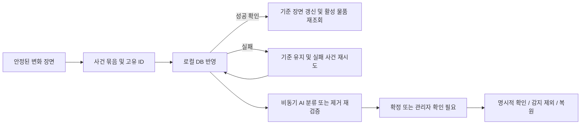

# Re:Found 사건 처리·검토·운영 구조 개선

실험 전에 앱의 전제까지 재검토하고 필요하면 구조를 바꾸라는 사용자 요청을 반영했다. 무거운 탐지 모델을 매 프레임 실행하지 않고 로컬 사건 선별 후 외부 VLM을 호출하는 방향은 유지했다. 이번 수정은 관찰을 DB에 반영하는 순서, AI의 결정 권한, 관리자가 검토하는 과정과 전체 목록 조회를 바꾼다.

앞선 영상 안정성·계산량 개선은 `VISION_REVIEW_2026-09-18.md`에 기록되어 있다. 이 문서는 그 이후의 변경이다. 원본 코드 백업은 `output/maintenance/2026-09-18-architecture-review/source-before.zip`에 있다.

## 재현한 문제와 구현

| 문제 | 변경 |
|---|---|
| callback queue 포화나 DB 실패에도 기준 장면이 전진하여 감지가 사라짐 | 장면별 사건 묶음에 처리 확인을 도입. 모든 로컬 반영이 성공해야 기준 장면 전진 |
| 추가 물품의 DB 반영 전에 치우면 제거가 또 다른 추가로 해석됨 | 한 장면의 반영을 기다리는 동안 새 사건 확정을 보류. 성공 직후 활성 물품 재조회 |
| 처리 실패를 재시도하면 일부 성공한 물품이 중복 등록될 수 있음 | 사건 UUID, 추가 물품의 고유 `source_event_id`, 묶음 내 성공 위치를 이용해 실패 사건만 재시도 |
| 복원·이동 전의 오래된 관찰이 나중에 적용됨 | 관찰 시점 `tracking_revision`을 사건에 실어 현재 물리 추적 상태와 비교 |
| 메타데이터·만료 상태 변경도 물리 관찰을 무효화함 | 이름·분류·기한과 `stored`↔`due` 전환은 추적 revision 유지 |
| DB 목록 조회 실패를 빈 보관소로 해석함 | 최근 정상 박스는 표시하되 새 분석·초기 기준 확정을 보류. DB 조회 회복 후 계속 |
| 강한 AI 제거 판정이 추가 관찰·사진을 영구 삭제함 | AI는 분류 확정 또는 확인 필요를 결정. 감지 제외는 관리자가 수행하고 사진·행·이력 보존 |
| 제공자 이름의 `_review` 접미사가 업무 상태를 대신함 | 독립적인 `review_status`와 `review_reason`으로 상태·사유 관리 |
| 사라짐 재검증 실패가 활동 로그에만 남음 | 관리자 확인 목록에 표시되는 물품 review 상태도 함께 저장 |
| 최근 500건을 가져온 뒤 브라우저에서 검색·분류·정렬 | 전체 DB에서 조건·정렬 적용 후 한 페이지 조회. 전체 개수·범위·이전/다음 제공 |
| 최신 100건 밖의 오래된 만료·검토 대상이 대시보드에서 사라짐 | 기한 주의 물품과 확인 필요 물품을 별도 전체 DB 쿼리로 조회 |
| 상세 편집 중 AI 결과와 관리자의 입력이 서로 덮어씀 | 읽기 중 최신 상태 갱신, 편집 중 입력 보존, `expected_updated_at` 충돌 시 409 및 최신 항목 반환 |
| 기한만 수정해도 확인 필요가 해제됨 | 일반 저장과 ‘확인하고 저장’을 분리. 명시적 확인만 검토 완료 |
| 시연 항목 편집 시 가상 bbox가 실제 추적에 포함되고 시연 회수가 실제 물품에 적용됨 | 변경할 수 없는 `source_kind` 보존, 신규 시연 bbox 제거, 시연 회수 대상을 시연 출처로 제한 |

## 처리 경계

`VisionMonitor`는 처리 확인을 기다리는 장면을 하나만 보관한다. 미리보기는 계속 갱신하며 실패 재시도 간격은 0.5초부터 최대 5초까지 늘린다. 진단 queue는 사건 queue와 용량을 분리했다. `pending_changes`, `callback_retry_count`, `uncommitted_changes`, `inventory_connected`와 대기 phase를 상태 API·화면에 반영했다. 이 값은 현재 프로세스의 운영 진단이며 논문용 영속 원장이 아니다.

처리 중 카메라가 재연결되면 준비 시간을 기다린 뒤 보류된 장면 기준으로 후속 변화를 비교한다. 오프라인 중 요청한 수동 재기준화도 재연결 때 처리한다. privacy 또는 명시적 재기준화는 미처리 사건의 후속 전달·재시도를 취소한다. 이미 성공한 DB 반영은 보존하며 실행 중인 callback 한 건 및 접수된 VLM 작업은 끝날 수 있다. 취소된 미반영 건수와 사건 ID는 상태·로그에 남는다.

새 분류 서비스 `app/classification.py`는 원격 호출 전후의 상태를 확인하고, 결과와 활동 기록을 같은 DB 트랜잭션으로 저장한다. 정책 판단은 `app/item_policy.py`로 분리했다. `main.py`는 API와 서비스 연결을 담당한다. 확신도 범위를 벗어난 응답을 1.0으로 올려 자동 확정하던 정규화도 제거했다.

## 데이터와 API 계약

- 기존 생명주기 `stored`, `due`, `recovered`, `disposed`는 유지한다.
- `review_status`: `pending`, `needs_review`, `confirmed`, `dismissed`. 마지막 상태는 감지 제외를 뜻하며 실제 폐기와 다르다.
- `review_reason`: AI 거절·불확실·오프라인·대기열 포화·사라짐 재검증·관리자 변경 등의 사유다.
- `source_kind`: `camera`, `demo`, `manual`. 생성 후 일반 수정으로 바뀌지 않는다.
- `tracking_revision`: 물리 위치·참조 사진·실제 보관 여부·감지 제외/복원 변경 시 증가한다.
- `source_event_id`: 같은 추가 사건의 재시도 중복을 막는 고유 키다. 사건 원장 전체를 대신하지 않는다.

DB 시작 시 기존 행과 사진 경로·ID를 유지하면서 컬럼과 인덱스를 추가한다. 기존 provider가 `pending`이면 분석 대기, `offline` 또는 `_review` 접미사면 확인 필요로 이관한다. 기존 시연 출처는 provider와 보존된 preset 원문을 함께 확인한다. 이전 클라이언트를 위해 provider 표현은 일부 유지하지만 앱의 업무 분기는 명시적 상태를 사용한다.

`GET /api/items`는 `status`, `review`, `category`, `q`, `sort`, `limit`, `offset`을 받는다. 기본 48개, 최대 100개이며 `{items,total,limit,offset}`을 반환한다. `holding`은 기한과 무관한 보관 물품 전체, `attention`은 기한 도래·임박 물품이다. count와 페이지 조회는 같은 읽기 트랜잭션을 사용한다. 페이지 범위를 벗어나면 마지막 페이지로 보정한다. 검색의 `%`, `_`, `\`는 와일드카드가 아닌 입력 문자로 취급한다.

`POST /api/items/{id}/dismiss`는 추적·기한 처리·새 알림 대상에서 제외하며 증거를 남긴다. 기존 restore API는 같은 ID를 다시 보관 대상으로 복원하고 확인 필요로 돌린다. PATCH의 `confirm_review=true`는 명시적 확인이다. `expected_updated_at`이 현재 편집본과 다르면 저장하지 않고 충돌을 반환한다. 편집·연장·감지 제외와 해당 활동 기록은 원자적으로 저장한다.

## 검증과 남은 경계

검증 로그와 최종 파일 해시는 `output/maintenance/2026-09-18-architecture-review/`에 보관한다. 임시 SQLite, 가짜 카메라, 실제 capture/dispatcher 스레드 및 모의 원격 응답을 사용한다. 부분 성공 후 재시도, 느린 DB 반영 사이 제거, 재연결, privacy/재기준화, DB 조회 실패, 오래된 revision, 데이터 이관, 500건 초과 검색, 원자적 rollback, 편집 충돌 및 시연 격리를 검증한다. 프런트는 Node controller 테스트와 HTML ID·ARIA 검사를 사용한다.

최종 Python 테스트 240개, Node 테스트 25개, Python compileall과 JS 문법 검사를 통과했다. 의도적으로 바뀐 계약(AI 거절 보존, 명시적 확인, 묶음 전달, 사건 UUID, 시연 bbox 제거)에 맞게 기존 테스트를 수정하고 별도 회귀 검증을 추가했다.

Windows 개발 PC/OpenCV 5/단일 스레드에서 변경 전후를 같은 설정으로 한 번씩 실행했다. 정적 장면은 13.809→13.791ms/처리 프레임, added pair 중앙값은 86.864→87.731ms였다. 160개 가상 입력 프레임에서 분석112·미리보기80, 정적 사건0이 같았고 added 사건의 종류·박스·확신도·증거 JPEG 4개 SHA256도 일치했다. 약1% 차이는 단일 패스의 변동이며 성능 향상이나 Pi 성능의 증거가 아니다. 이 검사는 callback 소비자·DB 반영 비용을 측정하지 않는다. 결과는 `vision-preservation-comparison.json`을 따른다.

프로세스 강제 종료·전원 차단 전 아직 DB에 접수되지 않은 장면은 자동 복구하지 않는다. VLM 작업도 영속 queue로 재실행하지 않으며, 재시작 때 남은 pending 물품은 확인 필요로 전환한다. 이 경계는 논문용 영속 사건/호출 원장 작업과 함께 추가로 다룰 수 있다.

감지 제외는 현재 관찰 기록을 운영 대상에서 빼는 기능이다. 새로운 물리 변화로 발생한 별도 사건까지 영구 무시하는 공간 마스크는 아니다. 카메라의 자동 회수는 화면상 사라짐이며 실제 소유자 반환을 증명하지 않는다.

실제 Pi·CSI/USB 카메라·유료 VLM·SMTP·기존 운영 DB는 이번 검사에 사용하지 않았다. 브라우저의 실제 화면 렌더링과 현장 정확도·발열·장시간 자원 사용은 별도 확인 대상이다. 기존 논문·PDF·PPTX와 실측 placeholder는 변경하지 않았다. 다음 현장 검증에서는 정지 감시뿐 아니라 빠른 투입 후 제거, 연속 두 물품 투입, 네트워크/DB 장애, 제외·복원 후 재감지도 포함한다.
