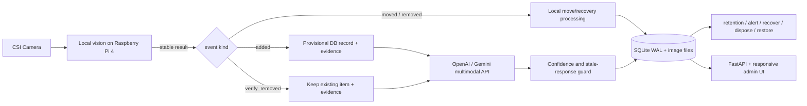

# Re:Found 논문 작성용 AI 인계 패킷

> 최신 사용자 결정과 재개 위치는 [대화 인계 요약](SESSION_HANDOFF_2026-09-16.md)을 먼저 읽는다. 최신 발표본은 PDF 캡처 4장 `REFOUND_PDF_CAPTURE_BRIEFING.pptx`이며, 실제 성능 측정은 아직 수행하지 않았다.

> 원고·발표 자료 최신 개정: 2026-09-16. `REVISION_STATUS.md`를 먼저 읽는다. 전체 초안은 실측 전 문장으로 개정했고 참고문헌 17개, 입력 항목 297종, SVG 구조도 4개다. 아래 확장 후보 문헌·과거 검증 기록은 현재 원고의 인용 목록·이번 실행 결과와 구분한다.  
> 구현 사실 인계 기준: 2026-09-15  
> 기준: 현재 저장소의 `README.md`와 실행 코드  
> 목적: 이 파일과 저장소를 다른 AI에 전달하여 학부 캡스톤 논문 초안을 작성하기 위한 사실·논지·실험 설계 모음

## 0. 이 문서를 사용하는 법

다른 AI에는 최소한 다음을 함께 전달한다.

1. 전체 초안 `docs/paper/PAPER_DRAFT_JDCS.md`
2. 결과 입력표 `docs/paper/RESULTS_FILL_SHEET.md`
3. 구현 사실과 주장 경계를 정리한 이 파일
4. 루트 `README.md`
5. 실험 절차 `docs/paper/EXPERIMENT_GUIDE.md`
6. 투고처와 선행연구 전략 `docs/paper/VENUE_AND_RELATED_WORK_STRATEGY.md`
7. 실제 실험 후 생성한 `episodes.csv`, `events.csv`, 지표 요약 CSV

코드 교차검증이나 그림 제작까지 맡길 때는 `app/`, `experiments/`, `tests/`, `static/`, `templates/`, `scripts/`와 `docs/presentation/diagrams/`, `docs/presentation/assets/`도 추가한다.

현재 코드와 루트 README를 구현의 정본으로 사용한다. 과거 기획서·중간보고서·회의록 PDF는 아이디어의 역사만 보여 주며, Raspberry Pi 5, YOLOv8, 커스텀 CNN, 로컬 LLM, AWS RDS, Firebase, AR, 4인 팀, 과거 보관 기한 등 현재 구현과 충돌하는 내용이 있다. 논문의 구현 설명이나 성능 주장 근거로 사용하지 않는다.

이 문서에서 `[실험 후 입력]`, `[사용자 확인 필요]`로 표시한 값은 추측해서 채우지 않는다. 현재 저장소에는 현장 사건 검출 정확도, AI 분류 정확도, 실제 지연시간, CPU·메모리·온도, API 비용의 정량 데이터가 없다.

## 1. 가장 적합한 논문 주제

### 잠정 투고처

현재 기술 중심 원고의 1순위는 **한국디지털콘텐츠학회 디지털콘텐츠학회논문지(JDCS)**다. 디지털 영상처리·지능정보·IoT 응용 시스템과 실제 개발 사례라는 범위에 직접 맞고, Raspberry Pi 기반 시스템 논문의 게재 선례가 있다. **실천공학교육논문지(JPEE)**는 캡스톤 학습성과, 교육 모듈, 교육 적합성 평가를 추가하여 교육 연구로 재구성할 때의 2순위다. 세부 근거와 형식은 `VENUE_AND_RELATED_WORK_STRATEGY.md`를 따른다.

### 프로젝트 메타데이터

| 항목 | 현재 README 기준 |
|---|---|
| 프로젝트명 | 분실물 자동 추론 및 시각화 관리 AI 시스템 `Re:Found` |
| 교과목 | 2026 AI 캡스톤디자인 |
| 소속 | 동양미래대학교 인공지능소프트웨어학과 |
| 팀 | 상부상조(2조) |
| 지도교수 | 강환수 교수 |
| 팀장 | 장진석(20241499) — 기획·아키텍처, 로컬 비전, 멀티모달 AI, FastAPI, 관리자 웹, Pi 배포, 테스트·문서화 |
| 팀원 | 권기원(20241516) — 개발·시연 지원, 구현·발표 자료 검토, 자료 교정, 시연 준비·운영 지원 |
| 최종 산출물 | Raspberry Pi 카메라 장치, FastAPI 서버, 반응형 관리자 웹의 통합 프로토타입 |

논문 저자 순서와 CRediT 방식 기여도는 학교 규정과 두 팀원의 최종 합의로 확정한다.

### 권장 국문 제목

**저사양 엣지 디바이스에서 안정적 장면 변화 감지와 선택적 멀티모달 추론을 결합한 분실물 관리 시스템**

### 권장 영문 제목

**A Lost-Item Management System Combining Robust Scene-Change Detection and Selective Multimodal Inference on a Resource-Constrained Edge Device**

### 대안 제목

- 비전 중심: **고정형 엣지 카메라의 조명·미세진동 대응 장면 변화 감지 및 분실물 상태 추적**
- 시스템 중심: **로컬 우선 사건 감지와 클라우드 멀티모달 AI를 이용한 엣지 분실물 관리 시스템의 설계 및 구현**
- 서비스 중심: **분실물의 등록·보관·알림·회수를 통합한 사건 기반 엣지 비전 시스템**

“모션 인식 AI”라는 표현은 사람의 행동·제스처 인식으로 오해될 수 있다. 이 프로젝트의 정확한 핵심은 **고정 카메라 장면에서 물체의 추가·이동·제거 사건을 감지하고, 선택된 사건의 의미만 멀티모달 AI로 추론하는 것**이다.

### 권장 논문 유형

새로운 신경망 구조나 자체 학습 모델을 제안하는 논문이 아니라 다음에 초점을 둔 **시스템 설계·구현 및 실험 논문**으로 작성한다.

- Raspberry Pi 4 2GB에서 동작하는 경량 로컬 비전 파이프라인
- 실제 카메라의 미세 흔들림, 초점·노출, 국소 조명, 그림자에 대한 방어적 사건 판정
- 모든 프레임을 외부 AI에 보내지 않는 사건 기반 선택적 멀티모달 추론
- 네트워크·AI 장애에도 사건 기록을 보존하는 운영 설계
- 감지 이후 보관 기한, 알림, 회수, 폐기, 복원의 전체 생명주기 연결

## 2. 한 문장 연구 정의와 중심 주장

### 한 문장 정의

Re:Found는 고정 카메라의 연속 영상에서 안정화된 물체 상태 변화만 로컬에서 사건으로 추출하고, 사건 전후의 전체 장면과 변화 영역을 외부 멀티모달 AI에 선택적으로 전달하여 분실물의 의미 정보와 보관 생명주기를 관리하는 Raspberry Pi 기반 시스템이다.

### 논문의 중심 주장

저사양 엣지 장치에서는 매 프레임에 무거운 객체 인식 모델을 실행하는 대신, **기하 정합·안정화·변화 영역 추적을 로컬에서 수행하고 의미 판단이 필요한 사건에만 멀티모달 AI를 호출하는 하이브리드 구조**가 구현 가능성과 운영 복원력을 함께 확보하는 실용적인 설계가 될 수 있다.

단, “정확도를 높였다”, “호출량을 줄였다”, “실시간이다”와 같은 비교 주장은 아래 실험을 완료한 뒤에만 사용한다.

## 3. 문제 정의

고정 카메라 기반 분실물 관리에는 다음 문제가 있다.

- 카메라의 수 픽셀 흔들림이나 작은 회전이 화면 전체의 차이로 확대된다.
- 자동 노출·자동 초점, 그림자, 반사, 모니터 화면 변화가 물체 사건처럼 보일 수 있다.
- 사람이 물건을 놓거나 가져가는 동안의 큰 가림을 사건 결과로 잘못 판단할 수 있다.
- Raspberry Pi 4 2GB에서는 무거운 모델의 상시 추론이 부담스럽다.
- 외부 AI나 인터넷이 실패하더라도 물체가 놓였다는 사건 자체는 잃지 않아야 한다.
- 검출 결과는 단순 레이블에 끝나지 않고 보관·알림·회수 업무로 이어져야 한다.

따라서 입력은 카메라 프레임 (I_t), 출력은 사건 (e_t \in \{added, moved, removed, verify\_removed\}), 변화 영역 (b_t), 의미 분류 (c_t), 신뢰도 (q_t), 그리고 물품의 생명주기 상태로 정의한다.

## 4. 연구 질문과 검증 가능한 가설

### 연구 질문

- **RQ1.** 제안한 로컬 파이프라인은 단순 프레임 차분보다 카메라 미세 흔들림, 노출·초점 변화, 그림자 조건에서 사건 오탐을 줄이는가?
- **RQ2.** 안정화된 사건만 외부 AI로 전달하는 방식은 매 움직임 구간 또는 주기적 프레임 전송 방식보다 외부 요청 수와 전송량을 줄이는가?
- **RQ3.** 전체 장면 전후와 crop 전후를 함께 쓰는 4장 증거가 단일 crop 또는 단일 사후 이미지보다 추가·제거 방향과 물품 분류를 더 정확히 판단하는가?
- **RQ4.** Raspberry Pi 4 2GB에서 감지 지연, CPU, 메모리, 온도, 처리 FPS가 장시간 운영 가능한 범위에 있는가?
- **RQ5.** 인터넷·AI 장애에서 이미 저장된 임시 레코드를 보존하고, 저장 전 callback drop을 계측할 수 있는가?

### 가설

- **H1.** 기하 정합과 안정성 확인을 적용하면 무사건 방해 조건의 시간당 오탐 수가 감소한다.
- **H2.** 사건 기반 AI 호출은 동일 촬영 시간에서 외부 요청 수와 업로드 바이트를 감소시킨다.
- **H3.** 전체 장면과 crop의 전후 쌍을 함께 제공하면 방향 판정 정확도와 카테고리 macro-F1이 향상된다.
- **H4.** callback worker가 정상 접수해 임시 행 생성까지 완료한 추가 사건은 외부 AI 실패 후에도 보존된다.

## 5. 논문 기여점 후보

정량 평가 후 다음 중 입증된 것만 최종 기여점으로 쓴다.

1. 제한된 메모리의 Raspberry Pi에서 동작하도록 구성한 다단계 고정 카메라 사건 감지 파이프라인을 제시한다.
2. 전역 정합, 국소 조명 보정, 지속 경계 억제, 형태학적 후처리, 안정 시간 확인을 결합하여 실제 카메라의 비물체 변화를 방어한다.
3. 전체 장면 전후와 변화 crop 전후를 역할별 해상도로 전송하는 선택적 멀티모달 증거 구성을 제시한다.
4. 정상 접수된 added를 AI 응답 전에 임시 저장하고, added의 낮은 신뢰도·오프라인 결과를 확인 필요 상태로 보존하는 장애 허용형 처리 흐름을 구현한다.
5. 검출을 등록에서 끝내지 않고 보관 기한, 중복 방지 알림, 회수·폐기·복원, 안전 초기화까지 연결한 단일 장치 운영 구조를 제시한다.

## 6. 현재 구현의 사실 요약

### 하드웨어·소프트웨어

| 구분 | 현재 구현 |
|---|---|
| 엣지 장치 | Raspberry Pi 4 2GB |
| 카메라 | CSI 카메라 + Picamera2, 필요 시 OpenCV 카메라 입력 |
| 로컬 비전 | Python, OpenCV, NumPy |
| 서버 | FastAPI, 단일 프로세스 운영 전제 |
| 저장소 | SQLite WAL + 로컬 JPEG 파일 |
| 외부 의미 추론 | OpenAI Responses API 우선, Gemini 대체/선택 가능 |
| UI | Vanilla HTML/CSS/JavaScript 반응형 SPA, MJPEG 미리보기 |
| 배포 | systemd, Tailscale 비공개 HTTPS, 오프라인 전용 핫스팟 |
| 알림 | 웹 알림 + SMTP 이메일 |

사용자 제공 사실로 실제 Raspberry Pi 환경에서 구동을 확인했다. 논문에는 OS 버전, 카메라 모델, 렌즈·해상도, 전원, 냉각 방식, 실행 시간, 테스트 날짜를 추가 기록해야 한다.

### 전체 구조



### 사건 처리 흐름

1. 카메라 연결 후 기준 장면을 보정한다.
2. 연속 프레임에서 움직임을 감지한다.
3. 사람이 빠지고 설정된 정착 시간과 안정 시간이 지나기를 기다린다.
4. 기준 장면과 현재 장면을 정합하고 잔여 변화 마스크를 계산한다.
5. 변화 영역을 정리하고 기존 활성 물체와 비교하여 추가·이동·제거 후보를 만든다.
6. 이동은 가능하면 기존 물체 ID와 참조 이미지를 갱신한다.
7. 명확한 제거는 저장된 빈 배경과 비교해 로컬에서 회수 처리하고, 모호한 제거만 외부 AI 검증 후보로 보낸다.
8. callback worker가 정상 접수한 신규 추가는 외부 AI 호출 전에 임시 DB 레코드와 증거 이미지를 저장한다. callback queue가 이보다 먼저 포화되면 사건은 drop될 수 있다.
9. 외부 AI에는 전체 장면 전후(low detail)와 crop 전후(high detail), 최대 4장을 보낸다.
10. added의 충분히 확신한 결과만 이름·설명·카테고리를 확정하고 실패·낮은 신뢰도·불일치는 확인 필요 상태로 보존한다. verify_removed의 uncertain·저신뢰 결과는 기존 상태를 유지하고 활동 로그를 남긴다.
11. 카테고리별 보관 기한과 활동·알림 생명주기를 적용한다.

## 7. 핵심 기술 설계

### 7.1 로컬 비전 상태 기계

구현 상태는 `calibrating`, `monitoring`, `settling`, `stabilizing`, `analyzing`이다.

```text
calibrating
  -> 기준 장면과 카메라 상태가 준비되면 monitoring

monitoring
  -> 움직임 또는 누적 변화가 감지되면 settling

settling
  -> 움직임이 끝나고 settle_seconds를 충족하면 stabilizing
  -> 다시 움직이면 대기 시간을 갱신

stabilizing
  -> stable_seconds 동안 장면이 안정되면 analyzing
  -> 불안정하면 settling 또는 monitoring으로 복귀

analyzing
  -> 기준/현재 장면 정합
  -> 잔여 변화 마스크 및 후보 상자 생성
  -> 기존 물체 상태와 비교하여 사건 생성
  -> 참조 장면·추적 상태 갱신 후 monitoring
```

이 상태 기계의 목적은 움직이는 손이나 사람을 물체 결과로 분석하지 않고, 행동이 끝난 후의 안정 장면끼리 비교하는 것이다.

### 7.2 장면 정합과 변화 마스크

현재 구현은 다음 방식을 조합한다.

- 기준 장면의 특징점을 현재 장면으로 pyramidal Lucas–Kanade optical flow로 추적한다.
- 순방향/역방향 추적 오차로 불량 대응점을 제거한다.
- RANSAC 기반 `estimateAffinePartial2D`로 작은 평행이동·회전·등방 스케일을 보정한다.
- 특징점 방식이 불충분하면 phase correlation 기반 평행이동을 대체 경로로 사용한다.
- 전역 밝기·노출과 국소 조명 차이를 보정한다.
- Lab 색공간의 색차 정보와 밝기 차이를 함께 이용한다.
- 미세 흔들림에서 반복되는 경계를 지속 경계로 보아 억제한다.
- 형태학적 연산, 연결 성분/윤곽, 상자 병합으로 물체 후보를 만든다.
- 화면 가장자리, 거의 전체 화면 변화, 그림자성 변화, 질감 보존 정도를 이용해 방해 후보를 거른다.

이 조합 자체가 새로운 원천 알고리즘이라는 표현은 피한다. 논문의 기술적 가치는 기존 경량 기법을 제한된 장치와 실제 업무 흐름에 맞게 조합하고, 각 단계의 효과를 ablation으로 검증하는 데 둔다.

### 7.3 물체 상태 추적

각 활성 물체에는 물체 참조 crop과 물체가 없던 배경 참조가 함께 유지된다.

- 화면 내용 변화만으로 기존 물체가 회수된 것으로 처리하지 않는다.
- 활성 상자가 오래 남아 새 물체 후보를 가리지 않도록 상태를 재평가한다.
- 위치가 바뀐 물체는 고정 템플릿 경로를 먼저 사용하고, 어려운 경우 ORB 특징과 RANSAC 기반 대응으로 재배치 여부를 확인한다.
- 재배치로 판단하면 새 ID를 만들지 않고 기존 ID의 위치와 참조를 갱신한다.
- 제거 후 영역이 저장된 빈 배경과 충분히 일치하면 로컬 회수로 처리한다.
- 제거가 모호할 때는 `verify_removed` 사건으로 멀티모달 검증을 요청한다.

### 7.4 멀티모달 증거 설계

| 증거 | 역할 | 현재 전송 품질 |
|---|---|---|
| 전체 장면 변화 전 | 변화 전 맥락과 기존 물체 확인 | low detail |
| 전체 장면 변화 후 | 추가·제거 방향과 주변 맥락 확인 | low detail |
| 후보 crop 변화 전 | 후보 영역의 이전 상태 확인 | high detail |
| 후보 crop 변화 후 | 물체 종류·색상·재질·특징 식별 | high detail |

요청은 최대 4장으로 제한된다. 전체 장면은 방향과 맥락, crop은 세부 식별에 사용한다. 결과 스키마는 다음과 같다.

```json
{
  "action": "added|removed|uncertain",
  "name": "짧은 한국어 물건명",
  "description": "색상·재질·특징 설명",
  "category": "valuable|general|food",
  "estimated_value_krw": null,
  "confidence": 0.0
}
```

현재 기본 최소 신뢰도는 0.5이며 설정에서 변경할 수 있다. 논문 실험에서는 공급자, 정확한 모델 ID/버전, 날짜, 프롬프트, 신뢰도 문턱, temperature, 재시도 정책을 고정하고 기록한다. 외부 서비스 모델은 시간이 지나며 바뀔 수 있으므로 “OpenAI가 Gemini보다 우수하다” 같은 일반화 대신 **해당 실험 구성에서의 결과**로 한정한다.

### 7.5 장애 허용과 데이터 일관성

- callback worker가 정상 접수한 신규 물체는 AI 응답보다 먼저 임시 레코드와 이미지를 저장한다.
- AI 작업은 bounded pool로 실행되어 카메라 감시 스레드를 막지 않는다.
- added는 API 키 없음, 네트워크 오류, 파싱 실패, 낮은 신뢰도에서도 이미 생성된 레코드를 삭제하지 않고 확인 필요 상태로 둔다.
- added 응답은 임시 행의 pending 여부와 비확정 분기의 현재 상태·bbox를 확인하고, verify_removed 응답은 전체 tracking signature를 재검사하여 오래된 결과 적용을 막는다.
- change callback queue가 임시 저장 전에 포화되면 사건이 drop될 수 있으며, 현재 코드는 이를 분리한 영속 counter가 없어 추가 계측이 필요하다.
- 상태 변경과 활동 기록은 하나의 SQLite 트랜잭션으로 처리한다.
- 만료 알림은 동일 만료 주기에 중복 생성되지 않으며, 실패·대기 SMTP는 재시도한다.
- 초기화 시 생산자를 멈추고 SQLite 온라인 백업으로 WAL의 커밋까지 포함한 스냅샷, 캡처 파일, manifest를 만든 후 운영 데이터를 비운다.

### 7.6 물품 생명주기

| 카테고리 | 기본 보관 기한 | 예시 |
|---|---:|---|
| `valuable` | 90일 | 휴대전화, 지갑, 노트북, 귀금속 |
| `general` | 60일 | 우산, 의류, 필기구 |
| `food` | 1일 | 음료, 음식, 부패 가능 내용물 |

상태는 보관 중, 기한 도래, 회수, 폐기 흐름을 가지며 관리자 복원과 기한 연장을 지원한다. 1/60/90일은 법정 기한이 아니라 현재 프로젝트의 운영 정책이다.

### 7.7 구현 기본값

다음 값은 `app/config.py`의 현재 기본값이지, 최적임이 입증된 연구 결과가 아니다.

| 설정 | 데스크톱 기본 | Raspberry Pi 프로필 |
|---|---:|---:|
| 입력 해상도 | 1280×720 | 1280×720 |
| 카메라 FPS | 20 | 10 |
| 감시 FPS | 12 | 7 |
| 누적 변화 확인 FPS | 4 | 2 |
| 미리보기 FPS | 8 | 5 |
| 정합 분석 폭 | 480 px | 360 px |
| 후보 crop JPEG 품질 | 88 | 88 |
| 전체 장면 JPEG 품질 | 72 | 72 |
| `settle_seconds` | 3.0 s | 3.0 s |
| `stable_seconds` | 1.2 s | 1.2 s |
| 변화 임계값 | 24 | 24 |
| 최소 변화 면적 | 1800 px | 1800 px |

## 8. 코드 근거 지도

다른 AI가 논문 내용을 확인할 때 다음 파일을 우선 읽는다.

| 논문 내용 | 근거 코드 |
|---|---|
| 전체 설정과 Pi 저부하 프로필 | `app/config.py`의 `DEFAULT_SETTINGS` |
| Picamera2/OpenCV 입력 | `app/camera_sources.py` |
| 사건 데이터 구조와 비전 상태 기계 | `app/vision.py`의 `ChangeEvent`, `VisionStatus`, `VisionMonitor._run` |
| LK/RANSAC/phase correlation 정합 | `app/vision.py`의 `_estimate_translation`, `_estimate_euclidean_alignment` 주변 |
| 차이 마스크·후보 생성 | `app/vision.py`의 `_detect_changes` 주변 |
| 이동 물체 일치 | `app/vision.py`의 `_match_relocated_item` 주변 |
| 멀티모달 프롬프트·4장 증거·공급자 전환 | `app/ai.py`의 `SYSTEM_PROMPT`, `ObjectClassifier` |
| 임시 저장, 비동기 분류, stale 결과 방지 | `app/main.py`의 `create_provisional_item`, `classify_existing_item`, `item_tracking_signature` |
| 제거 검증과 사건 오케스트레이션 | `app/main.py`의 `verify_removed_item`, `handle_vision_change` |
| SQLite WAL·스키마·트랜잭션 상태 변경 | `app/store.py` |
| 만료 및 SMTP 재시도 | `app/notifier.py` |
| 온라인 백업과 안전 초기화 | `app/main.py`의 `backup_and_reset_operational_data` |
| 관리자 UI | `templates/index.html`, `static/app.js`, `static/styles.css` |
| Pi 설치·systemd·네트워크 | `scripts/raspberry-pi/`, `docs/guides/` |
| 논문 실험 스키마·ablation·매칭·지표 | `experiments/`, `scripts/experiments/`, `docs/paper/EXPERIMENT_GUIDE.md` |
| 검증 코드 | `tests/test_vision.py`, `test_api.py`, `test_store.py`, `test_services.py`, `test_camera_sources.py`, `test_reset.py`, `test_experiment_*.py` |

현재 FastAPI route decorator는 20개다. 이 숫자는 구현 규모 설명에는 쓸 수 있지만 성능 기여점은 아니다.

## 9. 현재 확인된 검증과 확인되지 않은 것

### 확인된 것

- 사용자에 따르면 실제 Raspberry Pi와 카메라에서 시스템이 동작했다.
- 현재 소프트웨어 테스트 스위트는 총 136개이며 2026-09-15 최근 점검에서 모두 통과했다.
- 기존 애플리케이션 회귀 테스트 82개에 실험 스키마·CSV·ablation·사건 매칭·지표·Pi 자원 기록 테스트 54개가 추가되었다.
- 테스트는 API, 저장소, 생명주기, 합성 카메라 장면, AI/메일 실패 처리, 초기화 안전장치와 실험 데이터 무결성을 다룬다.

### 아직 논문용으로 확인되지 않은 것

- 실제 현장 영상의 사건 precision, recall, F1
- 조건별 시간당 오탐 수
- 추가·이동·제거별 검출 성능과 위치 정확도
- 물품명·카테고리·방향에 대한 외부 AI 정확도
- 4장 증거의 효과
- Raspberry Pi의 p50/p95 지연, CPU, RSS 메모리, 온도, 전력
- 장시간 연속 실행 안정성
- 공급자별 비용·전송량·실패율

단위 테스트 통과를 “현장 정확도 100%”로 해석하면 안 된다.

## 10. 논문용 실험 설계

### 10.1 실험 장비 기록

다음 정보를 논문 실험 환경 표에 반드시 넣는다.

- Raspberry Pi 정확한 모델과 RAM: Pi 4 2GB
- Raspberry Pi OS 이름·버전, 32/64 bit, kernel, Python, OpenCV 버전
- 카메라 모듈 모델, 센서, 렌즈/화각, 장착 높이·각도·거리
- 실제 입력 해상도와 FPS, Pi 프로필 설정 전체
- 전원 어댑터, 케이스, 방열판/팬 여부, 주변 온도
- 네트워크 종류와 평균 업로드 지연
- 외부 AI 공급자, 모델 ID, 호출 날짜, 리전/계정 조건
- 실험 코드 commit hash 또는 제출용 소스 압축본 checksum

### 10.2 데이터 수집 단위

프레임 단위보다 **사건 episode 단위**로 평가한다. 한 episode는 안정된 이전 장면, 사람/손의 개입, 안정된 이후 장면을 포함한다.

권장 최소 구성은 다음과 같다. 현실적인 범위에 맞게 수량은 바꿀 수 있으나 변경 이유를 쓴다.

| 축 | 권장 수준 |
|---|---|
| 물품 | 20종 이상, 형태·크기·색·재질 다양화 |
| 사건 | added, removed, moved, no-event disturbance |
| 조명 | 정상, 어두움, 밝음, 국소 그림자/반사 |
| 카메라 방해 | 미세진동, 작은 충격, 자동 노출·초점 변화 |
| 가림 | 손만 등장, 몸통 가림, 짧은/긴 가림 |
| 배경 방해 | 화면 켜짐/꺼짐, 기존 물체의 작은 흔들림 |
| 반복 | 주요 조건 조합당 10회 이상 권장 |

예시 목표는 실제 사건 300 episodes와 무사건 방해 120 episodes다. 이것은 통계적으로 자동 보장되는 수치가 아니라 학부 프로젝트에서 조건별 결과를 볼 수 있게 하는 권장치다. 시간 제약이 있으면 먼저 4개 사건 유형 × 4개 조명/방해 조건 × 10회로 균형 표본을 만든다.

원본 영상 또는 일정 간격 프레임, 사건 시작/종료 시각, 물체 ID, 실제 사건, 실제 bbox, 환경 조건을 보존한다. 동일 episode를 모든 baseline과 ablation에 재생해야 공정한 paired comparison이 가능하다.

### 10.3 정답 라벨

각 episode에 다음 정답을 사람이 기록한다.

- `ground_truth_event`: added / removed / moved / none
- `object_id`: 이동 전후 동일성
- `bbox_after` 또는 제거 전 bbox
- `category`: valuable / general / food
- 표준 물품명과 허용 동의어
- 방해 조건과 조명 조건
- 행동 종료 시각과 장면 안정 시각

가능하면 두 명이 독립 라벨링하고 불일치를 합의한다. 물품명은 완전 문자열 일치 대신 사전 정의된 동의어 또는 상위 개념 허용 규칙을 사용한다.

### 10.4 사건 매칭 규칙

- 예측 사건은 정답 사건의 행동 종료 후 미리 정한 허용 창 안에 발생해야 한다. 권장 시작값은 `settle_seconds + stable_seconds + 5초`다.
- 사건 종류가 같고 후보 bbox의 IoU가 기준 이상이면 true positive로 본다. 권장 시작값은 IoU 0.3이며 작은 물체 때문에 0.5도 함께 보고한다.
- 중복 예측은 첫 번째만 TP, 나머지는 FP로 계산한다.
- `moved`는 기존 ID가 유지되고 새 위치가 맞아야 성공이다. 새 ID가 생성되면 사건 검출은 맞더라도 ID 보존 실패로 별도 기록한다.
- `none` episode에서 발생한 모든 사건은 FP다.

규칙과 문턱값은 결과를 본 뒤 바꾸지 말고 실험 전에 고정한다.

### 10.5 핵심 지표

사건 감지는 다음을 보고한다.

\[
Precision = \frac{TP}{TP+FP},\quad Recall = \frac{TP}{TP+FN},\quad
F1 = \frac{2PR}{P+R}
\]

- added/removed/moved별 precision, recall, F1과 macro-F1
- 실제 연속 무사건 유효 감시 1시간당 false events와 안정 이미지 쌍의 무사건 표본 오탐 발생률
- 이동 ID 보존율과 중복 ID 생성률 — 후자는 ID 평가 가능한 matched-moved TP 중 명시적 새 ID 생성 비율로 한정
- bbox IoU 평균·중앙값
- 행동 종료부터 로컬 사건 생성까지 지연 p50/p95
- 행동 종료부터 DB 임시 레코드까지 지연 p50/p95
- AI 포함 최종 확정까지 지연 p50/p95

의미 추론은 다음을 보고한다.

- added/removed/uncertain 방향 정확도와 confusion matrix
- category accuracy와 macro-F1
- 표준 물품명 top-1 허용 일치율
- `confidence >= threshold`인 표본의 selective accuracy와 coverage
- uncertain 비율, 잘못 확정한 비율, 수동 검토로 안전하게 보류한 비율

자원·운영은 다음을 보고한다.

- 프로세스 CPU 평균/최대, RSS 메모리 평균/최대, SoC 온도 평균/최대
- 실제 감시 FPS와 프레임 drop 비율
- episode당 외부 요청 수, 업로드 바이트, AI 왕복 지연, 실패율
- 시간당 또는 사건당 API 비용
- 2시간/8시간/24시간 연속 실행 중 카메라 재연결, 예외, 메모리 증가

### 10.6 비교 기준과 ablation

#### 로컬 비전 ablation

현재 구현된 1차 실험은 동일한 안정 before/after 이미지 쌍을 운영 코드의 `_detect_changes()`에 넣는 **방해요인 방어 코어 ablation**이다.

| profile | 누적 구성 |
|---|---|
| `plain` | 정합·전역/국소 조명 보정·지속 경계 jitter 억제 끔 |
| `aligned` | `plain` + LK/RANSAC/phase correlation 정합 |
| `aligned_global` | `aligned` + 전역 노출 보정 |
| `aligned_global_jitter` | 위 구성 + 지속 경계 jitter 억제 |
| `full` | 위 구성 + 국소 조명 보정 |

단, 모든 profile은 같은 contour/event 로직과 운영 코드의 다른 거부 규칙, 활성 물체/배경 참조 처리를 공유한다. 따라서 `plain`을 “grayscale absolute difference 기준선”으로 부르거나 `full`을 카메라·settling·DB·VLM까지 포함한 전체 파이프라인으로 부르면 안 된다. 이 runner는 코어 검출 정확도와 계산 시간만 측정한다.

논문용 2차 실험에서는 동일 녹화본에 대해 (1) 별도로 구현한 grayscale absolute difference 기준선, (2) 현재 코어 검출기, (3) settling/stabilizing 상태기계를 포함한 전체 로컬 파이프라인을 비교한다. 각 단계가 어떤 오탐 조건에 효과가 있는지 조건별 FP/hour와 recall을 함께 보고한다. 실행 절차와 현재 구현 경계는 `EXPERIMENT_GUIDE.md`를 따른다.

#### 멀티모달 증거 ablation

동일 사건과 동일 모델·프롬프트·날짜에 다음을 비교한다.

| 실험 | AI 입력 |
|---|---|
| A0 | 변화 후 crop 1장 |
| A1 | crop 전후 2장 |
| A2 | 전체 장면 전후 2장 |
| A3 | 전체 장면 전후 + crop 전후 4장, 현재 방식 |

방향 정확도, category macro-F1, uncertain 비율, 요청 바이트, 지연, 비용을 함께 본다. 4장이 무조건 우수하다고 미리 결론 내리지 않는다.

#### 호출 정책 비교

- 모든 움직임 episode 직후 호출
- 일정 주기의 장면 호출
- 현재 방식: 로컬 안정화와 후보 판정 후 호출

원본 영상에서 각 정책이 만들 요청 수를 실제로 세고, 이론적인 “매 프레임 호출” 수만으로 과장하지 않는다.

### 10.7 통계 보고

- precision·recall·정확도에는 95% Wilson confidence interval을 권장한다.
- 동일 episode의 두 방법 성공/실패 비교에는 McNemar test를 사용할 수 있다.
- 지연시간 차이는 중앙값, p95, bootstrap 95% CI를 보고한다.
- 현재 CLI는 지연 p50/p95와 표본 수를 만들지만 bootstrap CI는 자동 생성하지 않으므로 별도 paired/cluster 분석으로 계산한다.
- 여러 번 AI API를 호출한다면 각 표본의 반복 횟수와 변동을 공개한다.
- p-value만 쓰지 말고 절대 차이와 신뢰구간을 함께 쓴다.

### 10.8 측정 방법

- 각 단계에 `time.perf_counter_ns()` 기반 timestamp를 남긴다.
- Pi 자원은 제공된 `scripts/experiments/monitor_pi_resources.py`로 `/proc`와 `/sys`를 1초 간격 기록한다. 전력은 외부 계측기를 사용한다.
- 요청 직전 base64 이전/이후 바이트와 응답 시간을 기록한다.
- API 가격은 호출일의 공식 가격표와 실제 token/usage 필드를 사용한다.
- 로그에는 원본 이미지를 직접 넣지 말고 episode ID와 파일 경로를 둔다.
- 개인 정보가 촬영되면 즉시 비식별화하거나 해당 episode를 폐기한다.

## 11. 논문 초록 초안

### 실험 전 사실만 사용한 초안

고정 카메라를 이용한 분실물 자동 관리는 물체의 추가와 제거를 지속적으로 파악할 수 있지만, 실제 환경에서는 카메라 미세진동, 자동 노출과 초점 변화, 그림자, 사람에 의한 가림이 빈번한 오탐을 유발한다. 또한 제한된 자원의 엣지 장치에서 고비용 인식 모델을 모든 프레임에 적용하기는 어렵다. 본 논문은 Raspberry Pi 4 2GB에서 동작하는 로컬 장면 변화 감지와 외부 멀티모달 AI를 결합한 분실물 관리 시스템 Re:Found를 설계하고 구현한다. 제안 시스템은 Lucas–Kanade 특징 추적, RANSAC 기반 부분 affine 정합, phase correlation 대체 정합, 조명 및 지속 경계 보정, 안정 장면 상태 기계를 이용하여 물체의 추가·이동·제거 후보를 로컬에서 추출한다. 의미 추론이 필요한 사건에만 전체 장면 전후와 후보 영역 전후 이미지를 전송하며, callback worker가 정상 접수해 생성한 임시 레코드는 이후 외부 AI 실패에도 보존한다. 검출 결과는 SQLite WAL 기반 저장소에서 보관 기한, 알림, 회수, 폐기 및 복원 생명주기와 연결된다. 본 연구는 저사양 엣지에서의 사건 검출 정확도, 외부 요청량, 지연시간, 자원 사용량과 증거 구성별 의미 추론 성능을 평가하는 실험 방법을 제시한다.

### 실험 후 결과를 넣는 초안 틀

> 아래 대괄호를 실제 측정값으로만 교체한다.

고정 카메라 기반 분실물 관리는 미세진동, 조명 변화와 사람 가림으로 인한 오탐 및 저사양 엣지 장치의 계산 제약을 동시에 해결해야 한다. 본 논문은 Raspberry Pi 4 2GB에서 경량 장면 정합과 안정화된 사건 감지를 수행하고, 의미 추론이 필요한 사건에만 전후 전체 장면과 crop을 외부 멀티모달 AI로 전달하는 Re:Found를 제안한다. 총 `[N]`개 사건 episode와 `[H]`시간의 무사건 방해 영상에서 제안 파이프라인은 단순 프레임 차분의 F1 `[B0_F1]` 및 오탐 `[B0_FP_PER_H]건/시간`과 비교하여 F1 `[OURS_F1]`, 오탐 `[OURS_FP_PER_H]건/시간`을 기록했다. 사건 기반 호출의 외부 요청 수 변화는 비교 정책 대비 `[CALL_CHANGE]%`, 직렬화 payload byte 변화는 `[BYTE_CHANGE]%`였으며, Raspberry Pi에서 DB 임시 기록까지의 지연은 p50 `[P50]초`, p95 `[P95]초`, 최대 RSS는 `[RAM]MB`였다. 4장 증거 구성과 단일 사후 crop 사이의 방향 정확도 차이는 `[DIRECTION_DELTA]`%p, 카테고리 macro-F1 차이는 `[CATEGORY_DELTA]`였다. 결론 문장은 실제 방향과 신뢰구간에 맞춰 작성한다.

## 12. 권장 논문 목차

### 1. 서론

- 분실물 관리의 수작업 문제
- 고정 카메라 변화 감지의 현실적 방해
- 저사양 엣지에서의 상시 인식 제약
- 로컬 사건 감지 + 선택적 멀티모달 추론이라는 접근
- 연구 질문과 기여점

### 2. 관련 연구

- 엣지 컴퓨팅의 근접성, 응답성, 장애 완화
- 고정 카메라 frame differencing/background subtraction
- Lucas–Kanade 및 Shi–Tomasi 특징 추적
- RANSAC 기반 강인한 기하 모델 추정
- ORB 기반 경량 특징 매칭
- 멀티모달 비전 언어 모델을 이용한 zero-shot 물체 설명·분류
- 차별점: 자체 검출 모델 학습이 아니라 사건 gating, 전후 증거, 운영 생명주기의 결합

관련 연구 절은 아래 출발 문헌에서 인용 관계를 확장해 최소 15편 이상의 1차 문헌으로 보강한다. 기술 검색 시 원 논문과 공식 문서를 우선한다.

### 3. 시스템 요구사항 및 구조

- 하드웨어·소프트웨어 제약
- 전체 구조도
- 사건 및 데이터 흐름
- 오류 시 보존 원칙

### 4. 제안 방법

- 상태 기계와 안정 장면 선택
- 장면 정합
- 변화 마스크와 방해 억제
- 물체 추가·이동·제거 및 ID 유지
- 4장 멀티모달 증거와 신뢰도 처리
- DB와 생명주기 트랜잭션

### 5. 구현

- Pi 프로필과 스레드/작업 풀
- FastAPI, SQLite WAL, UI, 배포
- 개인정보 보호 모드와 안전 초기화

### 6. 실험 및 결과

- 데이터셋과 라벨링
- baseline/ablation
- 사건 검출 성능
- 멀티모달 성능
- 지연·자원·비용·장시간 안정성
- 실패 사례 분석

### 7. 논의

- 어떤 방해에 강하고 어떤 조건에서 실패하는가
- 외부 AI 의존성과 개인정보 trade-off
- 단일 카메라·단일 장치 적용 범위
- 실무 적용 시 인증·보안 보강 필요성

### 8. 결론

- 입증된 수치 중심 요약
- 다중 카메라, 로컬 경량 분류기, 재시도 queue 등 향후 연구

## 13. 필요한 그림과 표

### 기존 자료로 바로 만들 수 있는 그림

1. 시스템 구조도: `docs/presentation/diagrams/01-system-architecture.mmd`
2. 데이터·AI 흐름: `docs/presentation/diagrams/03-data-ai-design.mmd`
3. 데이터 모델: `docs/presentation/diagrams/05-data-model.mmd`
4. 4장 증거 예시:
   - `docs/presentation/assets/01_remote_before_crop.jpg`
   - `docs/presentation/assets/02_remote_after_crop.jpg`
   - `docs/presentation/assets/03_pen_before_crop.jpg`
   - `docs/presentation/assets/04_pen_after_crop.jpg`

### 새로 만들어야 하는 그림

- 상태 기계 그림
- 기준 장면 → 정합 → 차이 마스크 → 후보 상자 → 사건의 중간 결과 예시
- added/moved/removed 타임라인
- baseline별 조건별 오탐 막대그래프
- 지연시간 p50/p95와 CPU/RAM/온도 그래프
- 4장 증거 ablation confusion matrix

### 권장 표

- 구현 환경과 실제 장비 사양
- 데이터셋 조건 및 episode 수
- baseline/ablation 구성
- 사건별 precision/recall/F1와 95% CI
- AI 증거 구성별 방향 정확도·category macro-F1·uncertain·비용
- Pi 지연·FPS·CPU·RSS·온도
- 실패 사례와 원인·대응

## 14. 표현과 주장 경계

### 사용해도 되는 표현

- “설계하고 구현하였다”
- “실제 Raspberry Pi 환경에서 구동을 확인하였다” — 장비·절차·시간을 추가할 것
- “로컬 비전으로 사건 후보를 선별한 뒤 외부 멀티모달 AI를 호출한다”
- “정상 접수되어 생성된 임시 레코드는 이후 AI 실패에도 보존하도록 구현하였다”
- “136개의 자동화 테스트가 통과하였다” — 현장 정확도와 구분할 것

### 실험 전 사용하면 안 되는 표현

- “높은 정확도”, “강인함을 입증”, “실시간”, “최적화 완료”
- “비용을 크게 절감”, “네트워크 사용량 최소화”
- “모든 종류의 분실물을 인식”
- “완전한 오프라인 AI 시스템” — 의미 분류는 외부 API에 의존
- “개인정보가 외부로 전송되지 않는다” — AI 사용 시 전체 장면과 crop이 전송됨
- “자체 AI 모델을 개발/학습하였다” — 현재는 사전학습 멀티모달 API 사용
- “YOLOv8을 사용한다”, “RDS/Firebase를 사용한다” — 현재 코드와 다름
- “1/60/90일은 법적 보관 기준이다”

## 15. 한계, 윤리, 보안

### 현재 한계

- 단일 고정 카메라와 단일 서버 프로세스를 전제로 한다.
- 심한 카메라 이동, 넓은 시야 변화, 완전 가림, 겹친 물체, 매우 작거나 무늬 없는 물체에서 실패할 수 있다.
- 외부 AI가 없으면 의미 이름과 카테고리는 자동 확정되지 않는다.
- 오프라인 시 실패한 의미 분류를 영구 queue에서 자동 재처리하는 구조는 없다.
- 실행 중 privacy 전환 전에 callback/VLM queue에 들어간 작업은 계속될 수 있고, 프로세스 재시작 시 DB에 저장된 privacy 설정이 VisionMonitor에 자동 재적용되지 않는다.
- 현장 데이터셋과 정량 benchmark가 아직 없다.
- 외부 API 모델의 변경으로 재현성이 낮아질 수 있다.
- SQLite, 이미지, 백업은 기본적으로 평문 저장된다.
- 자체 로그인, 역할 기반 권한, CSRF 보호, 애플리케이션 TLS가 없다.
- 다중 카메라, 분산 동시 처리, 장기 운영 규모는 검증하지 않았다.

### 개인정보와 윤리

- 사람, 얼굴, 문서, 모니터, 출입구가 가능하면 촬영되지 않도록 카메라를 좁게 배치한다.
- 개인정보 보호 모드와 촬영 중단 절차를 실험 프로토콜에 포함한다.
- 연구용 원본 영상의 보존 기간, 접근 권한, 삭제 기준과 동의 절차를 정한다.
- 외부 AI로 전체 장면이 전송된다는 사실을 명시하고, 실제 배포에서는 ROI 마스킹·얼굴/문서 비식별화를 고려한다.
- 실제 “valuable” 분류가 보안 위험을 만들 수 있으므로 외부 공개 UI에는 상세 위치·고가 물품 목록을 노출하지 않는다.

## 16. 향후 연구

- 무거운 상시 모델이 아니라 소형 로컬 분류기를 1차 의미 필터로 추가
- 이벤트 재생 도구와 설정 플래그를 통한 재현 가능한 ablation harness
- 다중 카메라 간 물체 재식별과 위치 통합
- 영구 AI 작업 queue와 네트워크 복구 후 재처리
- 얼굴·문서·모니터 영역의 엣지 비식별화
- 장치별 자동 임계값 보정 및 환경 변화 감지
- 장기 운영을 위한 health probe, watchdog, 저장 용량 정책
- 인증, 역할 권한, 암호화 저장, 감사 로그
- 사용자 회수 확인과 실제 분실물 반환 성공률을 포함한 서비스 평가

## 17. 용어 통일

| 권장 용어 | 의미 | 피할 표현 |
|---|---|---|
| 장면 변화 감지 | 안정 장면 사이의 변화 탐지 | 막연한 모션 AI |
| 사건 감지 | added/moved/removed 판단 | 모든 프레임 객체 인식 |
| 물체 상태 추적 | 위치·존재·ID 갱신 | 범용 multi-object tracking이라고 과장 |
| 선택적 멀티모달 추론 | 사건 증거만 외부 VLM에 요청 | 완전 엣지 AI |
| 임시 레코드 | 정상 접수된 added의 AI 전 관찰 보존 행 | 모든 검출 사건이 이미 영속화되었다는 표현 |
| 확인 필요 대상 | added의 낮은 신뢰도·오프라인 결과 | verify_removed도 같은 flag가 설정된다는 표현 |
| 운영 정책 | 1/60/90일 보관 기한 | 법적 기준 |

## 18. 출발 참고문헌

BibTeX는 `docs/paper/REFERENCES.bib`에 있다.

1. B. D. Lucas and T. Kanade, “An Iterative Image Registration Technique with an Application to Stereo Vision,” IJCAI, 1981, pp. 674–679. <https://www.ijcai.org/Proceedings/81-2/Papers/017.pdf>
2. J. Shi and C. Tomasi, “Good Features to Track,” CVPR, 1994, pp. 593–600. DOI: <https://doi.org/10.1109/CVPR.1994.323794>
3. M. A. Fischler and R. C. Bolles, “Random Sample Consensus: A Paradigm for Model Fitting with Applications to Image Analysis and Automated Cartography,” Communications of the ACM, 24(6), 1981, pp. 381–395. DOI: <https://doi.org/10.1145/358669.358692>
4. E. Rublee, V. Rabaud, K. Konolige, and G. Bradski, “ORB: An Efficient Alternative to SIFT or SURF,” ICCV, 2011, pp. 2564–2571. DOI: <https://doi.org/10.1109/ICCV.2011.6126544>
5. M. Satyanarayanan, “The Emergence of Edge Computing,” Computer, 50(1), 2017, pp. 30–39. DOI: <https://doi.org/10.1109/MC.2017.9>
6. OpenCV, “Object Tracking,” 공식 문서. <https://docs.opencv.org/4.x/dc/d6b/group__video__track.html>
7. OpenCV, “Camera Calibration and 3D Reconstruction,” 공식 문서. <https://docs.opencv.org/4.x/d9/d0c/group__calib3d.html>
8. OpenCV, “Motion Analysis and Object Tracking,” 공식 문서. <https://docs.opencv.org/4.x/d7/df3/group__imgproc__motion.html>
9. Raspberry Pi Ltd., “The Picamera2 Library,” 공식 매뉴얼. <https://datasheets.raspberrypi.com/camera/picamera2-manual.pdf>
10. SQLite, “Write-Ahead Logging,” 공식 문서. <https://www.sqlite.org/wal.html>
11. OpenAI, “Create a Model Response,” 공식 Responses API 문서. <https://developers.openai.com/api/reference/cli/resources/responses/methods/create>
12. Google, “Gemini API Image Understanding,” 공식 문서. <https://ai.google.dev/gemini-api/docs/image-understanding>

OpenAI·Gemini·OpenCV·Picamera2·SQLite 문서는 구현 근거이며, 학술적 관련 연구 수를 채우는 논문으로 세지 않는 편이 좋다. 최종 관련 연구는 고정 카메라 변화 감지, background subtraction, 엣지 AI, selective/cloud offloading, VLM evidence prompting 분야의 1차 논문을 추가 검색한다.

## 19. 다른 AI에 그대로 줄 작성 지시문

아래 블록을 이 파일과 저장소에 붙여 전달한다.

```text
첨부한 PAPER_AI_HANDOFF.md와 현재 저장소의 루트 README 및 실행 코드를 구현의 유일한 정본으로 사용해 한국어 학부 캡스톤 논문을 작성하라. 과거 PDF 기획서는 구현 사실의 근거로 사용하지 말라.

논문 주제는 “저사양 엣지 디바이스에서 안정적 장면 변화 감지와 선택적 멀티모달 추론을 결합한 분실물 관리 시스템”이다. 새 딥러닝 모델을 학습한 연구처럼 쓰지 말고, Raspberry Pi 4 2GB의 로컬 사건 감지, 4장 전후 증거 기반 외부 멀티모달 추론, 장애 시 임시 기록 보존, 보관 생명주기 통합을 중심으로 시스템 논문을 작성하라.

코드에서 확인되지 않는 기능을 만들지 말고, 측정하지 않은 정확도·지연·CPU·비용 수치를 절대로 생성하지 말라. 실험값이 없는 부분은 [실험 후 입력]으로 남기고, 136개 자동화 테스트와 실제 장비 구동 확인을 현장 정확도와 구분하라. 안정 이미지 쌍 runner의 시간은 코어 `_detect_changes()`만 포함하며 종단간 실시간 지연이 아니다. `plain` profile도 순수 absolute-difference 기준선이 아님을 명시하라. 각 핵심 구현 설명에는 가능한 한 근거 파일/함수명을 메모로 달라.

구성은 제목, 국문/영문 초록, 서론, 관련 연구, 시스템 요구사항, 제안 방법, 구현, 실험 설계, 결과 표 자리표시자, 논의, 한계·윤리, 결론, 참고문헌 순서로 하라. 관련 연구는 원 논문과 공식 문서만 인용하고, DOI와 접근 가능한 URL을 검증하라. 결과가 제공되면 평균만이 아니라 사건별 precision/recall/F1, FP/hour, p50/p95 지연, 95% 신뢰구간, Pi CPU/RSS/온도, 요청 수·전송량·비용을 보고하라.
```

## 20. 논문 작성 전에 사용자에게 받아야 할 정보

다른 AI가 완성본을 만들기 전에 다음을 확인한다.

1. 학교 논문 양식, 목표 쪽수, 제출 파일 형식, 인용 스타일
2. 논문 저자 표기, 소속, 지도교수 표기, 기여도 표기 방식
3. 실제 Raspberry Pi OS·카메라 모델·장착 환경·냉각·네트워크
4. 실제 구동 날짜, 연속 구동 시간, 성공·실패 사례
5. 실험 가능한 물품 수와 촬영 가능 시간
6. OpenAI/Gemini 중 실제 최종 시연에 사용한 공급자와 모델 ID
7. 연구 영상에서 사람·얼굴·문서가 촬영되는지와 동의/폐기 방침
8. 논문 제출처가 정량 실험을 필수로 요구하는지

## 21. 최종 첨부 체크리스트

- [ ] `PAPER_AI_HANDOFF.md`
- [ ] 루트 `README.md`
- [ ] 현재 소스 코드와 테스트
- [ ] `REFERENCES.bib`
- [ ] `EXPERIMENT_GUIDE.md`와 고정한 실험 protocol
- [ ] 실제 값이 채워진 `episodes.csv`, `events.csv`, 지표 요약 CSV
- [ ] 장비와 카메라 설치 사진 1장
- [ ] 변화 전후 및 마스크·bbox 중간 결과 그림
- [ ] `pytest` 결과 캡처 또는 CI 로그
- [ ] Pi 자원 측정 로그와 그래프
- [ ] 외부 AI 호출 로그에서 키·개인정보를 제거한 요약
- [ ] 학교 논문 양식

이 패킷만으로는 정직한 “설계 및 구현” 초안은 작성할 수 있다. 심사에서 강한 “성능 검증 논문”으로 만들려면 제10절의 사건 데이터셋, ablation, Pi 자원 측정이 추가로 필요하다.
