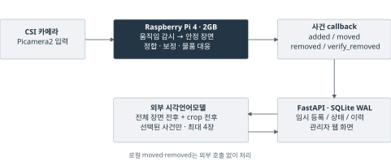
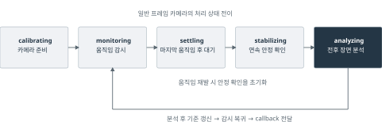
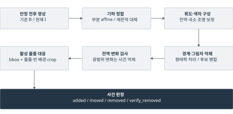
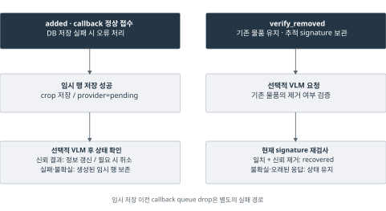

# 저사양 엣지 장치에서의 사건 기반 장면 변화 감지와 선택적 멀티모달 추론을 이용한 분실물 관리 시스템

> 2026-09-16 전면 개정본 · 구현 및 실험 설계 원고. 정량 실험 전이며 투고 최종본이 아니다. 결과 장의 이중 대괄호는 실제 측정 후 채운다. PDF의 “입력 대기”도 결과값이 아니다.

An Event-Triggered Scene Change Detection and Selective Multimodal Inference System for Lost-Item Management on a Resource-Constrained Edge Device

## 요약

분실물 보관대의 자동 관리는 물품의 종류를 인식하는 것과 함께 물품이 새로 놓이거나 이동하고 사라지는 상태 변화를 기록해야 한다. 그러나 고정 카메라에서도 조명 변화, 그림자, 초점 변화와 미세진동이 물품 변화와 유사한 영상 차이를 만들며, 제한된 연산 자원에서 지속적인 영상 분석과 관리 서비스를 함께 수행해야 하는 문제가 있다. 본 연구는 Raspberry Pi 4 2GB에서 사건 기반 장면 변화 감지와 선택적 멀티모달 추론을 결합한 분실물 관리 시스템 Re:Found를 설계하고 구현하였다. 로컬에서는 움직임 종료와 장면 안정화를 확인한 뒤 영상 정합, 조명 보정 및 기존 물품과의 대응을 통해 추가·이동·제거 후보를 판단한다. 신규 물품과 제거 여부가 모호한 경우에는 전체 장면과 변화 영역의 전후 이미지를 외부 시각언어모델에 전달한다. 정상 접수된 신규 사건은 원격 추론 전에 임시 저장하고, 인식 결과를 보관 기한과 상태 변경 이력에 연결한다. 본 연구는 저사양 장치의 사건 선별과 외부 의미 추론을 분담하는 시스템 구성에 초점을 두며, 향후 사건 검출 성능, 처리 지연, 자원 사용량과 외부 호출량을 평가할 계획이다.

주제어: 엣지 컴퓨팅, 장면 변화 감지, 멀티모달 인공지능, 분실물 관리, 라즈베리 파이

## Abstract

Automated management of a lost-item storage area requires recognizing objects and recording whether they have been added, moved, or removed. Even a fixed camera can produce misleading changes because of illumination shifts, shadows, focus variation, and slight vibration. Continuous monitoring must also share limited computing resources with management services. This study presents Re:Found, a system implemented on a Raspberry Pi 4 with 2 GB of memory that combines event-triggered scene change detection with selective multimodal inference. The local pipeline waits for motion to cease and the scene to stabilize, then applies image alignment, illumination compensation, and association with existing items to identify candidate changes. Newly added items and ambiguous removals are referred to an external vision-language model using before-and-after views of the full scene and the candidate region. New-item events accepted by the callback worker are provisionally stored before remote inference, and recognition results are linked to retention periods and status histories. The study focuses on dividing event selection and semantic inference between the edge device and the external model. Future evaluation will examine event detection performance, processing latency, resource consumption, and remote invocation frequency.

Keywords: Edge Computing, Scene Change Detection, Multimodal AI, Lost-Item Management, Raspberry Pi

# 1. 서론

## 1-1 연구 배경과 필요성

학교와 공공시설의 분실물 보관 업무에는 물품의 접수, 특징 기록, 보관 상태 확인과 처리 이력 관리가 함께 요구된다. 사진을 활용한 자동 분류는 등록 정보의 입력을 도울 수 있다. 정하민 등[1]은 단일 사진에서 물품의 분류와 태그를 추출하고 검색 순위를 제공하는 유실물 관리 시스템을 제안하였다. 이 접근은 등록·조회 과정에 초점을 두며, 보관대에서 물품의 상태가 바뀌는 시점을 영상으로 파악하는 문제는 별도로 다룰 필요가 있다.

영상 기반 연구에서는 사람과 소지품의 관계를 추적하여 분실 상황을 판단하기도 한다. 장현상 등[2]은 열차 영상에서 YOLOv8, Deep OC-SORT와 BLIP을 이용하여 사람과 가방의 탐지·추적·매칭 및 외형 설명을 수행하였다. 한편 양형준과 최규상[3]은 Raspberry Pi 4에서 차량 내부의 전후 이미지를 비교하고, MOG2와 히스토그램 평활화 및 윤곽선 필터링으로 분실물 후보를 추출하였다. 이러한 연구들은 사진 기반 등록, 소유 관계 추적, 전후 장면 비교라는 서로 다른 접근을 보여준다.

본 연구의 대상은 담당자가 분실물을 놓아두는 고정된 보관대이다. 이 환경에서는 물품이 놓인 뒤 같은 자리에 유지되는 동안에도 영상이 계속 입력된다. 따라서 분석의 핵심 단위를 개별 프레임에서 물품의 상태가 바뀌는 사건으로 옮기는 구성을 검토할 수 있다. 예를 들어 물품을 옆으로 옮긴 경우에는 신규 물품을 추가하는 대신 기존 기록의 위치를 갱신해야 하며, 조명만 변한 경우에는 물품 사건을 만들지 않아야 한다.

## 1-2 문제 정의

보관대의 상태 변화를 자동으로 기록하려면 영상의 차이와 실제 물품의 변화를 구분해야 한다. 조명이나 그림자는 물품이 그대로 있어도 차이를 만들 수 있으며, 카메라의 작은 흔들림은 기존 물품의 경계를 이동시킨다. Wallflower 연구[4]가 다룬 배경 유지 문제처럼, 영상의 변화량만으로 사건을 판단하기 어려운 조건이 존재한다. 물품을 놓는 손의 움직임과 손이 빠진 뒤 남은 물품의 변화도 구별해야 한다.

또한 물품의 상태 변화 판단과 종류에 대한 설명은 서로 다른 작업이다. 전후 영상에서 변화 위치를 찾았더라도 해당 물품의 이름과 특징을 바로 알 수는 없다. 반대로 모든 프레임의 의미를 외부 모델에 묻는 구성은 요청량과 네트워크 의존성을 고려해야 한다. 이 때문에 저사양 장치가 담당할 사건 선별 범위와 외부 모델에 맡길 의미 판단 범위를 함께 정하는 문제가 중요하다.

## 1-3 연구 목적과 범위

본 연구의 목적은 로컬 장면 변화 감지, 선택적 외부 멀티모달 추론 및 물품 관리 이력을 하나의 시스템으로 연결하는 것이다. 연구 질문은 다음과 같다. 첫째, 안정 장면 분석과 영상 보정은 추가·이동·제거의 검출 성능 및 오탐에 어떤 영향을 주는가. 둘째, 이 과정의 대기시간과 연산 부담은 Raspberry Pi의 처리 지연과 자원 사용량에 어떻게 나타나는가. 셋째, 필요한 사건만 외부 모델에 전달할 때 호출량, 누락과 최종 업무 성공률 사이에 어떤 관계가 있는가.

이를 위해 Raspberry Pi 4 2GB와 CSI 카메라를 사용하는 Re:Found를 구현하였다. 연구 범위는 보관대에 들어온 물품의 시각적 상태 변화와 관리 기록의 연결이며, 소유자의 신원이나 실제 반환 여부를 영상만으로 판정하지 않는다. 기술적 초점은 사건 선별과 의미 추론의 역할 분담 및 운영 과정의 통합에 있다. 현재 시스템 구현을 바탕으로 실험을 준비하고 있으며, 성능과 효율에 관한 결론은 정량 평가 후 제시한다.

# 2. 이론적 배경 및 관련 연구

## 2-1 장면 변화 감지와 안정 장면

장면 변화 감지는 서로 다른 시점의 영상에서 달라진 영역을 찾는 과정이다. 배경 차감은 현재 영상과 배경 모델의 차이로 전경 후보를 구하고, 차영상은 비교 대상 영상의 화소 차이를 이용한다. 이러한 방법은 물품의 종류를 미리 결정하지 않고도 변화 후보를 찾는 출발점이 된다. 다만 전경 후보가 곧 신규 물품을 의미하는 것은 아니다. 그림자, 반사와 노출 변화도 영상 차이에 포함될 수 있기 때문이다.

Wallflower[4]는 배경 유지 문제를 화소·영역·프레임 수준에서 다루었다. 이는 변화 후보를 해석할 때 국소적인 차이뿐 아니라 장면 전체의 변화도 고려해야 함을 보여준다. Re:Found가 다루는 보관대에서도 새 물품이 놓인 경우와 조명이 바뀐 경우를 같은 사건으로 처리하면 잘못된 등록이 발생할 수 있다. 따라서 변화 영역의 존재뿐 아니라 변화가 발생한 조건과 기존 물품의 상태를 함께 고려해야 한다.

본 연구에서 안정 장면은 움직임이 멈춘 뒤 일정 구간 동안 변화가 작게 유지되는 장면을 뜻한다. 움직임이 있는 동안에는 손이나 물품의 중간 위치가 관찰되지만, 안정된 전후 장면에서는 최종 배치의 차이를 비교할 수 있다. 영상 정합은 카메라 움직임 등으로 어긋난 영상의 좌표를 맞추는 처리이고, 조명 보정은 밝기 차이가 물품 변화 판단에 미치는 영향을 줄이기 위한 처리이다. 이러한 단계의 실제 효과는 보정 요소를 달리하는 비교 실험으로 확인해야 한다.

## 2-2 엣지 컴퓨팅과 선택적 영상 분석

엣지 컴퓨팅은 센서나 데이터 발생 지점 가까이에 연산을 배치하는 접근이다. Satyanarayanan[5]은 장치와 가까운 연산·저장 자원이 응답성과 연결 장애 대응에 기여할 수 있음을 설명하였다. 이 관점에서 카메라와 가까운 장치가 기초 분석을 수행하고, 추가 처리가 필요한 정보만 외부 서비스로 전달하는 구성을 생각할 수 있다. 처리 위치를 나누더라도 실제 지연과 자원 사용량은 장치와 작업 조건에 따라 측정해야 한다.

선택적 영상 분석의 사례로 NoScope[6]는 차이 검출기와 특정 영상·대상에 맞춘 모델을 단계적으로 결합하여 신경망 영상 질의의 연산을 줄였다. Reducto[7]는 카메라에서 저수준 영상 특징을 이용해 프레임을 선별하고, 영상 내용과 목표 정확도에 따라 필터링을 조정하였다. 두 연구는 모든 영상 입력에 동일한 분석을 반복하기보다 필요한 입력을 선별하는 접근의 근거가 된다.

Re:Found는 이러한 선별 관점을 물품의 상태 변화 사건에 적용한다. 로컬 장치는 추가·이동·제거 후보를 판단하고, 외부 모델은 선택된 사건의 의미를 보완한다. 여기서 사건 기반이라는 말은 일반 카메라 영상의 처리 단위를 뜻하며, 별도의 이벤트 카메라 센서를 사용한다는 의미는 아니다. 외부 호출 감소와 정확도 사이의 관계는 제안 시스템에서도 별도로 검증할 대상이다.

## 2-3 멀티모달 추론과 전후 시각 증거

시각언어모델은 이미지와 언어 정보를 연결하여 이미지의 내용을 설명하거나 질문에 답하는 모델이다. BLIP-2[8]는 사전 학습된 이미지 인코더와 대규모 언어모델을 연결하는 학습 구조를 제시하고 이미지에서 텍스트를 생성하는 능력을 보였다. 이는 영상 특징을 자연어 설명과 연결하는 이론적 배경이며, Re:Found에 BLIP-2를 직접 탑재했다는 뜻은 아니다.

분실물 관리에서는 물품이 무엇인지와 장면에서 어떤 상태 변화가 일어났는지를 함께 판단해야 한다. 변화 영역의 확대 이미지는 물품의 외형을, 전체 장면은 위치와 주변 맥락을 제공할 수 있다. 본 연구는 전체 장면 전후와 변화 영역 전후를 최대 네 장의 증거로 구성한다. 이 구성이 단일 이미지보다 유리한지는 향후 같은 사건에 대한 증거 구성 비교로 평가하며, 불확실한 응답을 운영 상태에 반영하는 방식도 함께 고려한다.

## 2-4 관련 연구와 본 연구의 위치

사진 기반 등록[1], 사람과 물품의 관계 추적[2], 차량 내부 전후 비교[3]는 분실물 관리의 서로 다른 작업을 다룬다. NoScope[6]와 Reducto[7]는 영상 분석에서 입력을 선별하는 전략을 제시하였다. 본 연구는 이들 접근을 참고하여 고정 보관대의 상태 변화, 선택적 의미 추론과 운영 기록의 연결에 초점을 둔다. 표 1은 성능 순위가 아니라 각 연구의 대상과 접근을 비교한 것이다.

**표 1. 관련 연구의 대상과 본 연구의 초점 / Table 1. Research targets and the focus of this study**

| 연구 | 주요 대상과 접근 | 본 연구에서 집중하는 문제 |
|---|---|---|
| 정하민 등[1] | 사진 기반 분류와 등록·조회 | 영상에서 등록 시점 선별 |
| 장현상 등[2] | 사람·가방 추적과 소유 관계 매칭 | 보관대 물품의 상태 변화 |
| 양형준·최규상[3] | 차량 전후 이미지의 변화 후보 | 연속 감시 중 추가·이동·제거 |
| NoScope[6]·Reducto[7] | 고비용 영상 분석 전 입력 선별 | 사건 증거와 외부 의미 추론의 연결 |
| Re:Found | 로컬 사건 선별과 선택적 외부 추론 | 감지부터 물품 관리 이력까지 통합 |

본 연구의 기여는 안정 장면을 이용한 사건 선별, 선택적 의미 추론 및 물품 관리 이력을 연결하는 시스템 구성에 있다. 특히 오탐 억제와 지연, 외부 호출 감소와 사건 누락의 관계를 함께 평가한다. 관련 연구와 데이터·장치·평가 단위가 다르므로 문헌의 정확도를 직접 비교하지 않으며, 동일 영상에 적용한 비교 구성으로 설계의 효과와 한계를 확인한다.

# 3. 시스템 설계

## 3-1. 설계 목표

시스템의 설계 목표는 다음과 같다. 첫째, Raspberry Pi 4 2GB와 CSI 카메라만으로 연속 감시와 웹 서비스를 함께 실행한다. 둘째, 자동 노출, 그림자, 초점과 미세진동을 신규 물품으로 오인하지 않도록 안정 장면 단위로 판단한다. 셋째, 같은 물품이 화면 안에서 이동한 경우 새 물품 레코드를 만들지 않고 기존 ID를 유지한다. 넷째, 성공적으로 임시 저장된 로컬 관찰은 이후 외부 AI 또는 네트워크 실패만으로 삭제되지 않게 한다. 다섯째, 자동 결과가 불확실하면 신규 물품은 확인 필요 상태로 두고 기존 물품은 자동 전환하지 않는다.

## 3-2. 전체 구조

Re:Found는 엣지 영상처리, 선택적 의미 추론, 서비스 생명주기의 세 계층으로 구성된다. Raspberry Pi에 연결된 고정형 CSI 카메라 영상은 Picamera2[9]로 입력되고, OpenCV 기반 VisionMonitor가 움직임, 안정 상태와 장면 변화를 판정한다. 영상 수집 스레드와 사건 callback 스레드를 분리하여 데이터베이스와 네트워크 처리가 프레임 수집을 직접 정지시키지 않게 하였다.

로컬 단계가 생성하는 사건은 added, moved, removed, verify_removed와 경계상자로 구성된다. added와 verify_removed만 외부 멀티모달 모델에 전달하고, 식별이 명확한 moved와 removed는 로컬에서 처리한다. FastAPI 계층은 사건 조정, 관리자 REST API와 MJPEG 미리보기를 담당한다. SQLite WAL[10]은 물품, 활동, 알림과 설정을 저장하고, 물품 crop 및 빈 배경 crop은 파일 시스템에 저장한다. 외부 의미 추론은 설정에 따라 OpenAI Responses API[11] 또는 Gemini API[12]를 사용한다. 최종 물품은 stored, due, recovered, disposed 상태로 관리되고, 분류별 보관 기한과 알림, 회수·폐기·복원 이력이 같은 서비스에 연결된다.

**그림 1. Re:Found의 전체 시스템 구조 / Fig. 1. Overall architecture of Re:Found**

시스템의 데이터 흐름은 다음과 같다. 카메라는 모든 프레임을 로컬로 제공하지만 외부로 보내지는 것은 안정 장면 변화가 확정된 사건의 증거뿐이다. 전체 장면 영상은 추론 요청 동안 메모리에 유지되며, 영구 증거는 후보의 물품 crop과 물품이 놓이기 전의 빈 배경 crop이다. 실행 중 개인정보 보호 모드를 적용하면 미리보기를 가리고 이후 capture 분석을 중단한다. 다만 전환 전에 callback 또는 VLM queue에 들어간 작업은 계속될 수 있다. 현재 구현은 프로세스 재시작 시 데이터베이스에 저장된 privacy 설정을 VisionMonitor에 자동 재적용하지 않으므로 배포 전에 부팅 동기화 보완이 필요하다.

## 3-3. 사건별 처리 정책

**표 2. 사건별 로컬 및 외부 처리 / Table 2. Local and remote processing by event type**

| 로컬 사건·내부 결과 | 의미 | 외부 VLM | DB 처리 |
|---|---|---:|---|
| added | 기존 활성 물품과 대응되지 않는 새 변화 | 호출 | 임시 물품을 먼저 생성한 뒤 의미 정보 갱신 |
| moved | 기존 물품이 다른 위치에서 재식별됨 | 호출하지 않음 | 동일 ID의 bbox·참조 영상 갱신 |
| removed | 기존 위치가 저장된 빈 배경과 명확히 일치 | 호출하지 않음 | 기존 ID를 운영상 recovered로 전환 |
| verify_removed | 제거인지 화면·외형 변화인지 모호함 | 호출 | 설정된 최소 신뢰도 이상의 제거 판단일 때만 전환 |
| 내부 억제 결과(진단 이벤트) | 화면 대부분이 동시에 변함 | 호출하지 않음 | ChangeEvent나 물품 행을 만들지 않고 기준 재설정 |

valuable, general, food의 기본 보관 기한은 각각 90일, 60일, 1일이다. 이는 법정 보관 기간이 아니라 현재 프로젝트의 운영 정책이며 관리자가 개별 물품의 기한을 수정할 수 있다. 영상에서 사라진 물품을 자동으로 recovered로 바꾸는 것 역시 시스템의 운영 상태 전환일 뿐, 실제 소유자에게 인계되었다는 물리적 사실을 증명하지 않는다.

## 3-4. 저사양 제약에 따른 설계 선택

본 연구에서 저사양 대응은 학습 모델의 양자화나 가지치기가 아니라, 분석 시점·해상도·외부 요청 범위를 조절하는 시스템 설계이다. 카메라 수집, 움직임 감시, 누적 변화 검사와 웹 미리보기의 목표 주기를 분리하고, 기하 정합에는 축소 영상을 사용한다. 세부 외형이 필요한 후보 crop은 별도로 유지한다. 표 3의 목표 FPS는 실행 설정이며 실제 처리율을 보장하지 않는다.

첫째, 안정 장면을 기다리면 행동 도중의 손과 중간 위치를 분석할 가능성을 줄일 수 있으나 물품을 놓은 즉시 등록되지는 않는다. 따라서 검출 F1과 함께 물리적 행동 종료부터 로컬 사건까지의 지연을 보고한다. 둘째, 정합·조명 보정·지속 경계 억제는 방해요인 오탐을 줄이기 위한 처리인 동시에 추가 연산과 실제 변화 약화의 원인이 될 수 있다. 보정 단계별 오탐, recall과 코어 계산시간을 함께 비교한다.

셋째, added와 verify_removed만 외부에 보내면 로컬에서 확정한 이동·제거에는 원격 요청이 필요하지 않다. 그러나 로컬에서 놓친 신규 물품은 외부 모델의 의미 판단 기회도 얻지 못한다. 호출률만 낮은 구성을 효율적이라고 결론 내리지 않고 gate recall과 종단간 업무 성공률을 함께 확인한다. 넷째, 임시 저장은 원격 응답을 기다리기 전에 관찰 기록을 남기는 정책이므로 미확정 등록과 관리자 확인 업무가 발생할 수 있다. 저장 이후 보존 성능과 저장 이전 callback drop을 분리해서 평가한다.

이러한 선택은 제한된 장치에서 감지와 관리 서비스를 함께 실행하기 위한 가설이다. 실제 비교 결과가 나오기 전에는 가장 빠른 구성, 최적 구성 또는 저전력 시스템으로 단정하지 않는다.

# 4. 제안 방법

## 4-1. 안정 장면 상태기계

카메라 연결 직후 자동 노출과 초점 변화가 기준 장면에 포함되지 않도록 보정 준비 구간을 거친다. 이후 상태기계는 calibrating, monitoring, settling, stabilizing, analyzing의 다섯 주요 상태로 동작한다. monitoring에서 움직임을 감지하면 settling으로 전이하고, 마지막 움직임 이후 설정된 대기시간이 지난 뒤 stabilizing에서 연속 무동작 시간을 확인한다. 장면이 지정 시간 동안 안정된 경우에만 기준 영상과 현재 영상을 분석한다. 분석이 끝나면 현재 안정 영상을 새 기준으로 갱신하고 monitoring으로 돌아간다.

**그림 2. 안정 장면 사건 검출 상태 전이 / Fig. 2. State transitions for stable-scene event detection**

인접 프레임만 검사하면 매우 천천히 놓이는 물품은 한 프레임의 움직임 임계값을 넘지 못할 수 있다. 이를 보완하기 위해 기준 장면과의 누적 변화도 낮은 빈도로 검사한다. 누적 변화가 충분하면 일반 움직임과 동일하게 settling과 stabilizing 절차로 진입한다. 이 설계는 행동 중 손과 사람을 물품으로 분석할 가능성을 줄이기 위해 분석 입력을 행동 전후의 안정 장면으로 제한한다.

## 4-2. 기하 정합

기준 영상 \(B\)와 현재 영상 \(I_t\)에서 Gaussian blur를 적용한 회색조 영상을 구한다. 기준 영상의 Shi–Tomasi 코너[13]를 Lucas–Kanade 피라미드 광류[14]로 현재 영상까지 추적한 뒤 다시 기준 영상으로 역추적한다. 순방향·역방향 오차가 허용 범위 안인 대응점만 남긴다. 대응점이 화면의 가로·세로에 충분히 퍼지고 3×3 격자의 여러 영역을 차지할 때 RANSAC[15] 기반 부분 affine 변환을 추정한다.

\[
F^{*}=\arg\max_F \sum_i \mathbf{1}\!\left(\lVert p'_i-Fp_i\rVert_2\leq\tau\right),\qquad
T^{*}=(F^{*})^{-1},\qquad
\hat I_t=W(I_t,T^{*})
\tag{1}
\]

여기서 \(p_i\)와 \(p'_i\)는 각각 기준 및 현재 영상의 대응점이고, \(\tau\)는 RANSAC 재투영 inlier 임계값이다. \(F^{*}\)는 consensus가 최대인 기준→현재 부분 affine 변환, \(T^{*}\)는 코드에서 warping에 사용하는 그 역변환이다. \(W\)는 현재 영상을 기준 좌표계로 warping하는 연산이다. 평행이동, 회전과 크기 변화가 설정 상한을 넘는 변환은 장면 전체의 카메라 이동으로 간주하지 않고 거부한다. 부분 affine 추정에 실패하면 같은 순·역방향 추적의 강건한 중앙 평행이동을 시도한다. 이 경로도 실패하고 두 영상의 밝기 분산과 최대 이동량 조건을 만족할 때만 phase correlation을 제한적 fallback으로 사용한다. 텍스처가 거의 없는 면에서는 이 조건을 만족하지 않아 정합을 적용하지 않을 수 있다. warping으로 생긴 무효 경계와 보간 seam은 마스크에서 제외하여 인공적인 테두리가 사건 후보가 되는 것을 막는다.

## 4-3. 조명 보정과 변화 마스크

정합된 현재 영상의 휘도 차를 \(s(x)=L_{\hat I_t}(x)-L_B(x)\)로 정의한다. 먼저 유효 화소에서 \(s(x)\)의 중앙값 \(m\)을 빼 전체 노출 이동을 보정한다. 다음으로 넓은 Gaussian 평활로 국소 조명 성분 \(\ell(x)\)을 근사한다. 국소 보정이 원래 차이를 오히려 키워 halo를 만들지 않도록 최종 휘도 차를 식 (2)처럼 제한한다.

\[
D_L(x)=\min \left(
\left|s(x)-m-\ell(x)\right|,
\left|s(x)-m\right|
\right)
\tag{2}
\]

회색조 차이만으로는 바닥과 휘도가 비슷하지만 색상이 다른 물품을 놓칠 수 있다. 따라서 Lab 색공간의 두 색차를 함께 사용하여 구조 차이 영상을 식 (3)으로 구성한다.

\[
D(x)=\max\left(D_L(x),\,|\Delta a(x)|,\,|\Delta b(x)|\right)
\tag{3}
\]

초점 호흡과 sub-pixel 진동은 기존 경계 양쪽에 띠 형태의 차이를 남긴다. 본 시스템은 두 영상의 Sobel 경계가 작은 이웃 안에서 함께 존재하는 화소를 “지속 경계”로 표시하고 후보의 핵심 마스크에서 억제한다. 양쪽 영상의 공통 경계에 해당하지 않는 변화는 남긴다. 다만 새 물품의 윤곽이 기존 경계와 겹치는 경우에는 실제 변화도 약화될 수 있으므로 작은 물품과 저대비 물품의 recall을 별도로 확인한다.

\(D(x)\)를 임계값으로 이진화한 뒤 3×3 열림, 9×9 닫힘과 5×5 팽창을 차례로 적용한다. 연결 성분은 면적과 밀도에 따라 표준형, 작은 조밀형, 긴 세장형 후보로 나누어 필터링하고 가까운 상자를 병합한다. 전역 보정 차이에서 낮은 임계값으로 얻은 support mask는 이미 검출된 상자를 확장하는 데만 사용한다. 이와 별도로 국소 보정이 저대비 물품 내부를 지운 경우에는 최소 면적·밀도·날카로운 경계 조건을 만족하고 조명 변화 전용 검사를 통과한 fallback 성분이 독립 후보가 될 수 있다. 화면 전체에서 변화 마스크가 차지하는 비율이 상한을 넘으면 조명 전환 또는 카메라 충격 같은 전역 변화로 억제한다. 화면 테두리의 길고 얇은 변화, 부드러운 밝기 변화와 색차가 작은 그림자 후보도 별도 규칙으로 거부한다.

**그림 3. 변화 후보 생성과 활성 물품 대응 절차 / Fig. 3. Change-candidate generation and active-item association**

## 4-4. 활성 물품 대응과 사건 판정

데이터베이스에서 현재 stored 또는 due 상태인 물품을 활성 물품으로 읽고, 등록 당시 저장한 물품 경계상자, 물품 crop 및 물품 배치 전의 빈 배경 crop을 로컬 검출기에 제공한다. 먼저 변화 후보와 활성 상자의 겹침으로 기존 위치 후보를 대응한다. 기존 상자와 떨어진 새 후보의 relocation 검사에서는 중심 거리와 크기 조건을 추가로 사용한다.

기존 위치의 변화 후 영상이 저장된 빈 배경 crop과 충분히 유사하고 등록 물품과의 유사도가 낮아지면 removed로 판정한다. 반대로 휴대전화 화면 점등처럼 경계상자 내부의 외형만 바뀌었거나 제거 근거가 경계값에 가까우면 자동 회수하지 않고 verify_removed로 분기한다.

기존 상자와 새 후보 상자가 함께 나타나는 경우에는 같은 물품의 이동 가능성을 검사한다. 빠른 경로는 등록 물품 템플릿과 후보 영역의 상관도, Lab 색상과 물체 영역 유사도를 결합한다. 고정 크기 템플릿이 배경 또는 크기 변화 때문에 불리한 경우에는 물품 전경에서 ORB 특징[16]을 추출하고, 양방향 비율 검사와 RANSAC 변환으로 재검증한다. 대응이 성공하면 새 물품 레코드를 만들지 않고 기존 item_id의 경계상자와 참조 crop을 갱신하며 moved 활동을 기록한다.

어떤 활성 물품과도 대응되지 않는 후보는 added로 발행한다. 한 분석 구간에서 전역 변화가 감지되면 국소 사건보다 전역 억제를 우선하고 현재 안정 장면으로 기준을 다시 설정한다.

## 4-5. 선택적 멀티모달 추론과 증거 구성

added 사건이 발생하면 후보 영역의 전·후 고해상도 crop과, 후보 상자가 표시된 전·후 전체 장면을 준비한다. 전체 장면은 변화 방향과 주변 문맥을 판단하는 저해상도 입력으로, crop은 물품의 종류, 색상과 재질을 식별하는 고해상도 입력으로 사용한다. 최대 입력 수는 네 장으로 고정한다.

모델에는 action, name, description, category, estimated_value_krw와 confidence를 JSON 형식으로 응답하도록 요청하고, 반환 문자열을 파싱한다. 모든 provider 경로에서 JSON schema가 강제되는 것은 아니므로 형식 오류가 가능하며, 파싱 오류는 실패로 처리한다. action은 added, removed, uncertain 중 하나이고 category는 valuable, general, food 중 하나이다. 전체 장면과 crop의 결론이 충돌하거나 새 물품이 분명하지 않으면 uncertain을 반환하도록 요청한다. added의 낮은 신뢰도 결과는 신규 레코드를 확인 필요 상태로 남긴다.

verify_removed 사건에서도 같은 전후 증거 구조를 사용하지만, removed 응답이 설정된 최소 신뢰도 이상일 때만 기존 물품을 recovered로 전환한다. uncertain 또는 낮은 신뢰도이면 물품 상태와 추적을 유지하고 활동 로그를 남긴다. moved와 명확한 removed는 로컬 참조 정보로 판단되므로 원격 요청을 만들지 않는다. 이에 따라 네트워크 전송 단위는 연속 프레임이 아니라 로컬에서 선별된 사건이다.

## 4-6. 임시 저장과 오래된 응답 방지

change callback worker가 정상 접수한 신규 added 사건은 저장에 성공한 경우 원격 요청 전에 물품 crop, 빈 배경 crop과 provider=pending인 임시 데이터베이스 행으로 저장된다. 이후 bounded worker에서 비동기 분류를 수행한다. API 키 부재, timeout, 응답 형식 오류, 원격 작업 대기열 포화 또는 낮은 신뢰도에서도 이미 생성된 임시 물품은 삭제하지 않고 확인 필요 상태로 보존한다. 반대로 멀티모달 모델이 충분히 높은 신뢰도로 “제거 방향”을 판정한 경우에만 잘못 생성된 임시 등록을 취소할 수 있다. 단, change callback queue가 임시 행 생성 전에 포화되면 사건 자체가 drop될 수 있으므로 이를 별도 장애 지표로 측정한다.

분류가 진행되는 동안 관리자가 정보를 수정하거나 물품이 이동·회수될 수 있다. added 분류는 임시 행의 provider가 여전히 pending인지 확인하여 관리자 수정 결과를 유지하고, 비확정 분기에서는 현재 상태와 bbox 변화를 추가로 확인한다. verify_removed는 요청 전후의 bbox, 참조 파일 경로와 갱신 시각으로 구성된 추적 signature가 모두 같은 경우에만 결과를 적용한다. 따라서 완전한 signature 재검사는 제거 검증 경로에 한정된다. 회수·폐기·복원과 활동 기록은 SQLite의 같은 트랜잭션에서 처리한다.

**그림 4. 임시 저장과 선택적 추론 처리 순서 / Fig. 4. Provisional persistence and selective inference sequence**

## 4-7. 전체 알고리즘

**알고리즘 1. 안정 장면 기반 사건 처리 / Algorithm 1. Event processing over stable scenes**

1. 카메라 준비 이후 안정 장면을 기준 영상 \(B\)로 설정한다.
2. 인접 프레임과 기준 장면의 차이로 움직임 또는 누적 변화를 감시한다.
3. 마지막 움직임 이후 settle 시간과 연속 stable 시간을 만족할 때 현재 영상 \(I_t\)를 확정한다.
4. 특징 기반 부분 affine 또는 제한된 평행이동으로 \(I_t\)를 \(B\)에 정합한다.
5. 전역·국소 조명, Lab 색차 및 지속 경계를 고려하여 변화 마스크와 후보 상자를 생성한다.
6. 변화 비율이 전역 상한을 넘으면 물품 사건을 억제한다.
7. 전역 변화가 아니면 후보를 활성 물품의 bbox, 물품 crop 및 빈 배경 crop과 대응한다.
8. 대응 결과에 따라 moved, removed, verify_removed 또는 added를 생성한다.
9. 로컬 분석 직후 결과 종류와 관계없이 \(B\leftarrow I_t\)로 갱신하고 monitoring으로 돌아간 뒤 사건 callback을 처리한다.
10. moved와 removed는 기존 ID에 로컬 반영한다.
11. added는 임시 레코드를 저장한 뒤 멀티모달 추론을 수행한다. verify_removed는 기존 물품의 추적 signature를 메모리에 보관하고 같은 최대 4장 증거로 추론한다.
12. added 응답은 임시 행이 pending일 때 적용하고, verify_removed 응답은 현재 signature가 요청 시점과 일치할 때만 신뢰도 정책에 따라 반영한다.

# 5. 구현 및 실험 설계

## 5-1. 구현 환경

Re:Found의 엣지 장치는 Raspberry Pi 4 Model B 2GB이며 CSI 카메라와 Picamera2/OpenCV를 사용한다. 애플리케이션은 Python 기반 FastAPI 단일 backend, SQLite WAL, vanilla HTML/CSS/JavaScript 관리자 화면으로 구성된다. 운영 서비스는 systemd로 시작하며 로컬 네트워크, Tailscale 또는 인터넷이 없는 경우 장치 hotspot에서 접근할 수 있다.

**표 3. Raspberry Pi 기본 영상 설정 / Table 3. Default vision settings for Raspberry Pi**

| 항목 | 설정값 |
|---|---:|
| 카메라 입력 해상도 | 1280×720 |
| 카메라 FPS | 10 |
| 로컬 감시 목표 FPS | 7 |
| 누적 변화 검사 FPS | 2 |
| 웹 미리보기 FPS | 5 |
| 정합 분석 폭 | 360 pixel |
| 후보 crop JPEG 품질 | 88 |
| 전체 장면 JPEG 품질 | 72 |
| 변화 threshold | 24 |
| 최소 변화 면적 | 1,800 pixel |
| 움직임 종료 대기 | 3.0 s |
| 추가 안정 확인 | 1.2 s |
| 외부 분류 worker | 1 |
| 동시 실행·대기 slot 상한 | 4 |

표 3은 소스 코드의 Raspberry Pi profile 기본값이다. 실험에서 설정을 변경한 경우 실제 실행 configuration과 detector 소스 hash를 결과와 함께 보관하고, 논문 표에는 실제 사용값을 보고한다. 실험 장치의 OS, 카메라 모듈, 렌즈, 냉각과 전원은 표 4에 별도로 기록한다.

**표 4. 실제 평가 장비 / Table 4. Hardware and software used in evaluation**

| 항목 | 실제 값 |
|---|---|
| 보드·메모리 | Raspberry Pi 4 Model B, 2 GB |
| 운영체제·커널 | [[EQUIP_OS_KERNEL]] |
| 카메라·렌즈 | [[EQUIP_CAMERA_LENS]] |
| 카메라 고정 거리·각도 | [[EQUIP_CAMERA_GEOMETRY]] |
| 저장장치 | [[EQUIP_STORAGE]] |
| 냉각·케이스 | [[EQUIP_COOLING]] |
| 전원·전력 계측점 | [[EQUIP_POWER_AND_METER]] |
| OpenCV/Python 버전 | [[EQUIP_OPENCV_PYTHON]] |
| VLM provider·model·버전/일자 | [[VLM_PROVIDER_MODEL_DATE]] |
| 네트워크 조건 | [[NETWORK_CONDITION]] |

## 5-2. 평가 데이터와 라벨링

실험 단위는 한 번의 행동과 그 후 안정화를 포함한 episode이다. 정답 사건은 added, removed, moved, none으로 구성하고, 내부 중간 상태인 verify_removed는 정답 종류에서 제외한다. 양성 사건에는 \(x,y,w,h\) 형식의 경계상자를 표시한다. moved의 정답 bbox는 이동 후 새 위치로 정의하고, 이동 전 위치와 item_id는 active_bbox와 active_item_id에 별도 기록한다. `action_end_at`은 물품 또는 이를 조작하는 손의 마지막 물리적 접촉이 끝나고 물품이 최종 상태에 머물기 시작한 첫 frame의 시각으로 라벨링한다. 같은 episode를 모든 ablation profile에 입력하여 대응 비교한다.

평가 자료는 목적에 따라 네 집합으로 분리한다. \(D_{pair}\)는 안정 전후 영상쌍으로 detector core와 표 8의 단계적 ablation에만 사용한다. \(D_{stream}\)은 연속 replay 또는 실시간 camera episode로 상태기계, ID, 표 7, false events/hour와 종단간 지연을 평가한다. \(D_{vlm}\)은 같은 사건 증거를 고정한 V1–V4 비교용이고, \(D_{fault}\)는 network 차단, timeout, malformed JSON, queue 포화와 오래된 응답을 통제하여 주입하는 장애 자료이다.

개발 표본과 최종 평가 표본을 분리한다. 평가 결과를 본 뒤 임계값을 조정한 표본은 최종 평가에 재사용하지 않고 개발 세트로 돌린다. 최종 평가 설정은 사전에 고정하고 실패 표본도 제외하지 않는다. 두 라벨러가 무작위 [[DOUBLE_LABEL_RATIO]]%를 독립 판정하고, 사건 종류의 Cohen’s \(\kappa\) [[LABEL_KAPPA]]와 bbox IoU [[LABEL_BBOX_IOU]]를 보고한 뒤 불일치를 합의한다.

**표 5. 평가 데이터 구성 / Table 5. Composition of the evaluation dataset**

| 사건 | 조건 | 개발 세트 | 최종 평가 세트 |
|---|---|---:|---:|
| added | 물품 [[OBJECT_TYPE_COUNT]]종, 거리·조명 교차 | [[N_DEV_ADDED]] | [[N_TEST_ADDED]] |
| removed | 동일 물품과 방해 조건 | [[N_DEV_REMOVED]] | [[N_TEST_REMOVED]] |
| moved | 이동 거리·크기·부분 가림 포함 | [[N_DEV_MOVED]] | [[N_TEST_MOVED]] |
| none | 정상·노출·그림자·jitter·초점·가림 | [[N_DEV_NONE]] | [[N_TEST_NONE]] |
| 합계 | 장소 [[SITE_COUNT]]곳, 촬영일 [[CAPTURE_DAY_COUNT]]일 | [[N_DEV_TOTAL]] | [[N_EVAL_EPISODES]] |

표 5의 최종 평가는 \(D_{stream}\)의 episode 수를 나타낸다. \(D_{pair}\)의 최종 공통 영상쌍은 [[N_PAIR_EVAL]]개이다. \(D_{vlm}\)은 exact action을 채점할 decisive 표본 [[N_VLM_ACTION]]개 중 GT-added [[N_VLM_GT_ADDED]]개와 GT-removed [[N_VLM_GT_REMOVED]]개, 그리고 안전한 상태 유지 결정을 따로 평가할 non-removal/retain 표본 [[N_VLM_RETAIN]]개로 구성하며 각 증거 구성을 사례당 [[VLM_REPEATS_PER_CASE]]회 반복한다. 연속 none 감시는 총 [[NONE_MONITORING_HOURS]]시간 수행한다. 워밍업, 의도적 카메라 중단과 연결 끊김은 유효 감시시간에서 제외하고 제외 구간을 원장에 기록한다. 안정 이미지 쌍의 source segment 길이는 촬영 출처 정보일 뿐, 연속 감시의 false events/hour 분모로 사용하지 않는다.

## 5-3. 비교 구성과 ablation

로컬 방해요인 방어 로직의 단계적 변화를 확인하기 위해 \(D_{pair}\)의 동일 안정 이미지 쌍에 표 6의 누적 profile을 적용한다.

**표 6. 로컬 방해요인 방어 ablation / Table 6. Ablation profiles for nuisance defenses**

| profile | 기하 정합 | 전역 노출 보정 | 지속 경계 억제 | 국소 조명 보정 |
|---|---:|---:|---:|---:|
| plain | × | × | × | × |
| aligned | ○ | × | × | × |
| aligned_global | ○ | ○ | × | × |
| aligned_global_jitter | ○ | ○ | ○ | × |
| full | ○ | ○ | ○ | ○ |

다섯 profile은 Lab 색차, morphology, contour, 그림자·전역 변화 거부와 활성 물품 사건 로직을 공유한다. 따라서 plain은 “순수 회색조 절대차”가 아니라 방해요인 방어 네 요소를 끈 공통 코어이다. 또한 앞 단계가 유지된 상태에서 다음 요소를 더하는 누적 구성이라 각 모듈의 독립적 인과효과를 뜻하지 않는다. 차이는 고정된 순서에서의 조건부 변화로 해석하고, 독립 효과가 필요하면 full에서 한 요소씩 제거하는 leave-one-out을 추가한다.

핵심 baseline과 제안 방법은 모두 \(D_{stream}\)의 같은 replay 구간에서 비교한다.

- B0: 순수 회색조 절대차와 면적 threshold [[IMPLEMENT_AND_RUN_PURE_ABSDIFF]]
- B1: frame-level 코어만 사용하고 settle/stable 상태기계를 사용하지 않은 replay [[IMPLEMENT_AND_RUN_NO_STATE_MACHINE]]
- B2: 적응 가우시안 혼합 배경 모델[17]을 사용하는 OpenCV MOG2와 동일한 개발 세트 조정·사건 시간창·후처리 조건 [[IMPLEMENT_AND_RUN_MOG2]]
- P1: 본 연구 전체 로컬 pipeline
- V1: 변화 후 crop 1장
- V2: 후보 crop 전·후 2장
- V3: 전체 장면 전·후 2장
- V4: 전체 장면 전·후와 후보 crop 전·후 4장

B0–B2는 입력 FPS, 워밍업 [[BASELINE_WARMUP_SECONDS]]초, 후보 병합 시간창과 활성 물품 대응을 동일하게 하고 foreground 생성기와 상태기계 사용 여부만 다르게 한다. foreground 후보를 added/moved/removed로 변환하는 공통 adapter는 [[BASELINE_EVENT_ADAPTER_PROTOCOL]], B0·B1의 참조 영상 갱신 규칙은 [[B0_B1_REFERENCE_UPDATE_RULE]], B2의 history·varThreshold·background ratio·learning rate는 [[B2_MOG2_PARAMETERS]]로 개발 세트에서 고정한다. 이 항목을 확정하기 전에는 세 사건 종류의 Macro-F1을 baseline 간 비교하지 않는다.

VLM 비교에서는 \(D_{vlm}\)의 같은 사건, 같은 단일 provider와 모델 ID, 동일 실행 기간, 동일한 prompt 공통 부분 및 무작위화한 호출 순서를 사용하며 auto fallback을 끈다. exact action 정확도는 GT-added와 GT-removed의 decisive 표본에서 uncertain을 오답으로 채점한다. 이와 별도로 added 경로의 register/hold 결정과 verify_removed 경로의 recover/retain 결정을 운영 이진 지표로 평가하여, non-removal 사례에서 안전한 uncertain을 의미 오분류와 구분한다. 물품명·category 정확도는 GT-added에만 계산하고 uncertain 비율, non-abstained 정확도, 요청 byte, token/비용과 지연을 기록한다. 원격 모델은 시간에 따라 바뀔 수 있으므로 provider, model ID, 실행 날짜, 반복 횟수와 prompt hash를 함께 저장한다. 현재 애플리케이션은 이 usage와 timestamp를 보존하지 않으므로 실험 전에 별도 VLM 원장을 추가한다.

## 5-4. 평가 지표와 통계

정답 상자 \(B_g\)와 예측 상자 \(B_p\)의 IoU는 식 (4)로 정의한다.

\[
\operatorname{IoU}(B_g,B_p)=
\frac{|B_g\cap B_p|}{|B_g\cup B_p|}
\tag{4}
\]

사건 종류가 같고 IoU가 0.30 이상이며 사전에 정한 시간창 안에 있는 정답과 예측을 episode별 일대일 최적으로 매칭한다. 0.30은 작은 물품과 보정 후 확장된 후보를 허용하는 사전 protocol 값이며, IoU 0.50에서도 민감도 분석을 함께 제시한다. 매칭 수를 먼저 최대화하고, 동률이면 더 이른 자격 예측과 높은 IoU를 순서대로 사용한다. 종류별 precision, recall과 F1은 식 (5)로 계산한다.

\[
P=\frac{TP}{TP+FP},\qquad
R=\frac{TP}{TP+FN},\qquad
F1=\frac{2TP}{2TP+FP+FN}
\tag{5}
\]

added, removed, moved의 support와 함께 micro 및 macro 값을 보고한다. 표 7의 “로컬 확정 사건” 평가에서 verify_removed는 제거 정답으로 직접 맞추지 않고 보류로 처리하므로, 최종 removed가 없는 해당 episode는 로컬 removed FN에 포함된다. 이와 별도로 removed 또는 verify_removed가 제거 정답 위치를 찾은 비율인 제거 후보 recall과, 그중 verify_removed로 보낸 referral 비율을 보고한다. VLM 이후의 확정 removed는 final stage에서 다시 채점한다. none episode의 오작동률은 하나 이상의 확정 사건을 낸 none episode의 비율이고, verify_removed/VLM referral 발생률은 비용 지표로 별도 집계한다. 연속 감시 오탐률은 식 (6)과 같다.

\[
\text{False events/hour}=
\frac{N_{\mathrm{FP,none}}}{T_{\mathrm{eligible,h}}}
\tag{6}
\]

안정 이미지 쌍은 유효 wall-clock 감시시간을 제공하지 않으므로 해당 자료에서 false events/hour를 계산하지 않는다. ID 보존율과 ID 할당 오류율은 정답 및 예측 item_id가 모두 존재하는 matched moved TP에서만 계산하고, scorable N과 coverage를 함께 제시한다. 운영 중복 행 생성률은 이 조건부 지표와 분리하여, 전체 GT-moved episode 중 added 오분류 등을 통해 기존 ID 외의 새 DB 행이 생성된 비율로 정의한다. 예측 ID를 생성하지 않는 안정 이미지 쌍 실험으로 어느 ID 지표도 주장하지 않는다.

누적 지연은 action_end→local event, action_end→provisional DB와 action_end→final commit으로 정의하고, AI round trip은 ai_request_at→ai_response_at으로 별도 계산한다. 지연 분포는 성공적으로 매칭된 TP에 조건부이므로 각 분포에 유효 N/전체 N, recall과 timestamp 결측률을 함께 제시한다.

같은 촬영 구간의 반복 episode가 독립이 아닐 수 있으므로 recording session을 주 cluster 단위로 사전 고정한 10,000회 bootstrap 95% 신뢰구간을 precision, recall, F1, Macro-F1, IoU, 지연과 profile 차이에 사용한다. 동일 물품은 development와 final evaluation에 걸치지 않게 group 분할하고, physical item을 cluster로 둔 결과는 민감도 분석으로만 제시한다. bootstrap seed는 [[BOOTSTRAP_SEED]]로 고정한다. 단순 비율의 Wilson 구간을 보조로 제시하고, false events/hour에는 Poisson exact 구간과 run-block bootstrap을 사용한다. McNemar 검정은 F1 자체가 아니라 “해당 episode의 모든 정답 사건을 여분 확정 사건 없이 맞혔는가”라는 paired 이진 endpoint에만 적용하고 Holm으로 다중비교를 보정한다. V1–V4도 같은 사건의 paired 비교와 session-cluster bootstrap을 사용하며 유의수준은 .05로 정한다.

선택 정책, 조건부 VLM과 종단간 업무 성능은 서로 다른 분모로 보고한다. added gate recall의 분모는 모든 GT-added이고, removal gate recall의 분모는 결과를 보지 않은 두 라벨러가 사전 기준으로 지정한 [[N_GT_AMBIGUOUS_REMOVAL]]개 모호 제거 episode이다. 각각에서 logical inference job이 생성된 비율과 provider HTTP attempt 수를 사용한다. VLM 조건부 성능은 \(D_{vlm}\)의 실제 입력 대상 안에서 평가하고, name과 category는 GT-added에만 적용한다. decisive GT-added/removed의 exact action에서 uncertain은 오답으로 처리하되 coverage와 응답한 표본만의 selective accuracy를 함께 보고한다. 종단간 업무 성공은 \(D_{stream}\)에서 로컬 누락까지 포함해 added는 올바른 등록, moved는 기존 ID 갱신, removed는 최종 운영 상태 전환까지 완료한 episode 비율로 정의하고 사건 종류별 및 macro 값을 함께 보고한다.

선택 호출의 전송량 비교에서 no-gating 기준선은 analyzing에 도달한 모든 eligible episode의 전후 전체 장면을 제안 방법과 같은 해상도와 JPEG 품질 72로 전송한다. 후보가 없는 none episode에 가상 crop을 만들지 않는다. 전송 byte는 HTTP/TLS header를 제외하고 base64와 JSON을 포함한 직렬화 요청 payload 크기로 정의하며, JPEG 원본 byte 합도 보조 원장에 남긴다. 선택 정책의 실제 1–4장 payload와 이 기준선의 누적 byte 및 요청 수를 같은 replay 구간에서 비교하되, 증거 구성이 다르므로 이를 VLM 정확도의 직접 비교로 해석하지 않는다.

## 5-5. 장치 자원과 운영 안정성

Raspberry Pi에서 서비스와 동시에 1초 간격으로 주 프로세스 CPU, device-normalized CPU, RSS, system CPU, 가용 메모리, load, 저장공간과 thermal-zone 온도를 기록한다. 첫 CPU 표본은 누적값 차분이 없어 제외할 수 있다. 전력은 소프트웨어로 추정하지 않고 외부 AC 또는 USB 전력계가 있을 때만 측정점, 주변장치 포함 범위, 계측기 정확도와 sampling rate를 함께 보고한다.

[[LONG_RUN_DURATION_HOURS]]시간 연속 실행에서 카메라 disconnect, reconnect 시간, 원격 요청 실패, provisional 보존, DB 오류와 서비스 재시작을 기록한다. capture read 실패, monitor scheduler skip과 callback queue drop은 서로 다른 지표로 정의한다. 현재 코드는 누적 frame/drop counter와 영속 원장을 제공하지 않으므로 실험 전에 계측을 추가해야 하며, queue 포화 시 물품 change와 진단 callback도 구분한다. \(D_{fault}\)에서는 실패 유형별 주입 횟수와 보존·복구 결과를 보고한다. 소스 코드의 자동화 test [[REGRESSION_TEST_COUNT]]개 통과 여부는 구현 회귀 검증으로만 보고하며 현장 인식 정확도의 근거로 사용하지 않는다.

## 5-6. 설계 선택과 평가 결과의 연결

첫 번째 연구 질문은 표 7의 동일 연속 영상 비교와 표 8·9의 방해요인 평가로 검증한다. 상태기계의 효과는 B1과 P1의 차이로, 보정 단계의 누적 효과는 공통 코어의 profile 차이로 확인한다. F1 상승만 보고하지 않고 사건 종류별 recall, none 오작동과 제거 검증 의뢰율을 함께 제시한다.

두 번째 질문은 표 10의 장치 자원과 누적 지연으로 검증한다. 기본 settle 3.0초와 stable 1.2초는 순차 대기 정책이므로 계산이 빠르더라도 사용자 체감 등록은 늦을 수 있다. 검출기의 마지막 motion 시각은 영상에서 라벨링한 action_end_at과 다를 수 있어 두 값을 대체하지 않는다. 필요하면 개발 세트에서 대기시간 후보를 비교한 뒤 본 실험 설정을 고정하고, 최종 평가 결과에 맞추어 유리한 설정을 다시 선택하지 않는다.

세 번째 질문은 표 11의 증거 구성 비교와 전체 감시 구간의 gate recall·호출 수·업무 성공률로 검증한다. V1–V4는 같은 사건에서 시각 증거만 바꾸는 비교이며, 선택 호출과 no-gating의 전송량 비교는 대상 집합과 증거 구성이 다른 운영 비교이다. 두 결과를 합쳐 네 장의 증거 또는 선택 호출이 정확도를 향상시켰다고 단정하지 않는다. 표 13의 장애 주입은 외부 실패 시 기록 보존과 상태 변경 차단을 별도로 평가한다.

# 6. 평가 결과 보고안 및 논의

> 정량 실험 전의 결과 작성 틀이다. 아래 값은 현재 미측정이며, 관찰된 성능을 보고하는 문장이 아니다. 표와 지표를 실제 원장으로 채운 뒤 절 제목을 “결과 및 논의”로 바꾸고, 관찰 결과에 맞춰 초록과 결론을 개정한다.

## 6-1. 사건 검출과 물품 식별

**표 7. \(D_{stream}\)의 로컬 확정 사건 및 baseline 성능 / Table 7. Decisive local-event and baseline performance on \(D_{stream}\)**

(a) 제안 방법의 사건 종류별 결과

| 사건 | Support | Precision (95% CI) | Recall (95% CI) | F1 (cluster 95% CI) | IoU p50 (cluster 95% CI) |
|---|---:|---:|---:|---:|---:|
| added | [[SUPPORT_ADDED]] | [[P_ADDED_CI]] | [[R_ADDED_CI]] | [[F1_ADDED]] | [[IOU_ADDED_P50]] |
| removed | [[SUPPORT_REMOVED]] | [[P_REMOVED_CI]] | [[R_REMOVED_CI]] | [[F1_REMOVED]] | [[IOU_REMOVED_P50]] |
| moved | [[SUPPORT_MOVED]] | [[P_MOVED_CI]] | [[R_MOVED_CI]] | [[F1_MOVED]] | [[IOU_MOVED_P50]] |
| micro | [[SUPPORT_TOTAL_POSITIVE]] | [[P_MICRO_CI]] | [[R_MICRO_CI]] | [[F1_MICRO]] | [[IOU_ALL_P50]] |
| macro | — | [[P_MACRO]] | [[R_MACRO]] | [[LOCAL_MACRO_F1]] ([[LOCAL_MACRO_F1_CI]]) | — |

(b) 공통 replay 구간의 전체 구성 비교

| 구성 | Macro-F1 | none 오작동률 | FP/hour (Poisson 95% CI) | local p95 (ms) |
|---|---:|---:|---:|---:|
| B0: pure absdiff | [[B0_MACRO_F1]] | [[B0_NONE_RATE]] | [[B0_FP_HOUR]] | [[B0_LOCAL_P95]] |
| B1: no state machine | [[B1_MACRO_F1]] | [[B1_NONE_RATE]] | [[B1_FP_HOUR]] | [[B1_LOCAL_P95]] |
| B2: MOG2 | [[B2_MACRO_F1]] | [[B2_NONE_RATE]] | [[B2_FP_HOUR]] | [[B2_LOCAL_P95]] |
| P1: Re:Found full | [[LOCAL_MACRO_F1]] | [[NONE_EPISODE_TRIGGER_RATE_CI]] | [[FALSE_EVENTS_PER_HOUR]] | [[LOCAL_LATENCY_P95_MS]] |

표 7은 로컬에서 확정한 사건을 기준으로 작성한다. IoU 0.50의 민감도 분석 값은 [[IOU50_MACRO_F1_CI]], 제거 후보 recall은 [[REMOVAL_CANDIDATE_RECALL_CI]], 제거 후보 중 검증 의뢰율은 [[REMOVAL_VERIFY_REFERRAL_RATE_CI]]에 기록한다. verify_removed 증가로 확정 오탐이 줄어들어도 이를 제거 성능 향상으로 해석하지 않고, 최종 단계의 제거 결과와 함께 검토한다.

moved의 ID 평가는 채점 가능한 [[MOVED_ID_SCORABLE_N]]개와 coverage [[MOVED_ID_COVERAGE]]를 먼저 보고한다. matched TP에서의 ID 보존율 [[MOVED_ID_RETENTION_CI]] 및 다른 ID 할당률 [[MOVED_ID_ASSIGNMENT_ERROR_CI]]과, 전체 GT-moved의 DB 중복 행 생성률 [[MOVED_DUPLICATE_ID_RATE_CI]]을 구분한다. 화면상의 bbox 이동 성공만으로 관리 기록의 중복 방지를 주장하지 않는다.

none의 확정 사건 발생률은 [[NONE_EPISODE_TRIGGER_RATE_CI]], 검증 의뢰율은 [[NONE_VERIFY_REFERRAL_RATE_CI]]이다. 연속 none 감시의 유효 [[NONE_MONITORING_HOURS]]시간에서 확정 오탐 [[NONE_FALSE_EVENT_COUNT]]건을 집계하고, FP/hour의 Poisson exact 구간 [[FALSE_EVENTS_PER_HOUR_POISSON_CI]]과 run-block bootstrap 구간 [[FALSE_EVENTS_PER_HOUR_BLOCK_CI]]을 함께 보고한다. FP가 0이어도 감시시간과 신뢰구간을 생략하지 않는다.

## 6-2. 방해요인 억제와 추가 연산

**표 8. \(D_{pair}\)의 단계적 방해요인 방어 구성(\(N\)=[[N_PAIR_EVAL]]) / Table 8. Incremental nuisance-defense configurations on \(D_{pair}\) (\(N\)=[[N_PAIR_EVAL]])**

| profile | Macro-F1 | none 오작동률 | core p50/p95 (ms) | episode-correct McNemar p |
|---|---:|---:|---:|---:|
| plain | [[ABL_PLAIN_F1]] | [[ABL_PLAIN_NONE_RATE]] | [[ABL_PLAIN_LATENCY]] | [[ABL_PLAIN_P_ADJ]] |
| aligned | [[ABL_ALIGNED_F1]] | [[ABL_ALIGNED_NONE_RATE]] | [[ABL_ALIGNED_LATENCY]] | [[ABL_ALIGNED_P_ADJ]] |
| aligned_global | [[ABL_GLOBAL_F1]] | [[ABL_GLOBAL_NONE_RATE]] | [[ABL_GLOBAL_LATENCY]] | [[ABL_GLOBAL_P_ADJ]] |
| aligned_global_jitter | [[ABL_JITTER_F1]] | [[ABL_JITTER_NONE_RATE]] | [[ABL_JITTER_LATENCY]] | [[ABL_JITTER_P_ADJ]] |
| full | [[ABL_FULL_F1]] | [[ABL_FULL_NONE_RATE]] | [[ABL_FULL_LATENCY]] | 기준 |

plain 대비 full의 Macro-F1 차이 [[ABL_F1_DELTA]]와 none 오작동률 차이 [[ABL_NONE_DELTA]]를 코어 지연 변화와 함께 해석한다. 고정 순서의 누적 ablation이므로 각 단계의 독립적 기여나 순수 차영상 대비 효과를 의미하지 않는다. 오탐이 줄면서 저대비 물품의 FN이 늘면 이를 보정의 상충 관계로 보고한다.

**표 9. 방해요인별 full profile 오작동 / Table 9. Errors of the full profile by nuisance type**

| 방해요인 | Challenge episode | FP | FN | episode 오작동률 |
|---|---:|---:|---:|---:|
| 전역 노출 변화 | [[NUIS_EXPOSURE_N]] | [[NUIS_EXPOSURE_FP]] | [[NUIS_EXPOSURE_FN]] | [[NUIS_EXPOSURE_RATE]] |
| 국소 조명·그림자 | [[NUIS_SHADOW_N]] | [[NUIS_SHADOW_FP]] | [[NUIS_SHADOW_FN]] | [[NUIS_SHADOW_RATE]] |
| 미세진동 | [[NUIS_JITTER_N]] | [[NUIS_JITTER_FP]] | [[NUIS_JITTER_FN]] | [[NUIS_JITTER_RATE]] |
| 초점 변화 | [[NUIS_FOCUS_N]] | [[NUIS_FOCUS_FP]] | [[NUIS_FOCUS_FN]] | [[NUIS_FOCUS_RATE]] |
| 가림·겹침 | [[NUIS_OCCLUSION_N]] | [[NUIS_OCCLUSION_FP]] | [[NUIS_OCCLUSION_FN]] | [[NUIS_OCCLUSION_RATE]] |
| 정상 none | [[NUIS_NONE_N]] | [[NUIS_NONE_FP]] | — | [[NUIS_NONE_RATE]] |

방해요인별 표본 수가 다르면 FP 건수만으로 취약 조건의 순위를 정하지 않는다. 동일 물품·조건의 전후 영상, 최종 마스크와 실패 이유를 실측 후 대표 사례로 추가하고, 성공 사례만 골라 설명하지 않는다. 그림 3은 처리 구조를 나타내는 모식도이며 실제 실험 마스크가 아니다.

## 6-3. 장치 성능과 사용자 체감 지연

**표 10. Raspberry Pi 종단간 성능과 자원 / Table 10. End-to-end performance and resource use on Raspberry Pi**

| 지표 | 유효 N/전체 N | 평균 | p50 | p95 | 최대 |
|---|---:|---:|---:|---:|---:|
| local event 지연 (ms) | [[N_LAT_LOCAL]] | [[LAT_LOCAL_MEAN]] | [[LOCAL_LATENCY_P50_MS]] ([[LOCAL_LATENCY_P50_CI]]) | [[LOCAL_LATENCY_P95_MS]] ([[LOCAL_LATENCY_P95_CI]]) | [[LAT_LOCAL_MAX]] |
| provisional DB 지연 (ms) | [[N_LAT_DB]] | [[LAT_DB_MEAN]] | [[LAT_DB_P50]] | [[LAT_DB_P95]] | [[LAT_DB_MAX]] |
| AI round trip (ms) | [[N_LAT_AI]] | [[LAT_AI_MEAN]] | [[LAT_AI_P50]] | [[LAT_AI_P95]] | [[LAT_AI_MAX]] |
| final commit 지연 (ms) | [[N_LAT_FINAL]] | [[LAT_FINAL_MEAN]] | [[LAT_FINAL_P50]] | [[LAT_FINAL_P95]] | [[LAT_FINAL_MAX]] |
| process CPU (%) | [[N_RESOURCE]] | [[CPU_MEAN]] | [[CPU_P50]] | [[CPU_P95]] | [[CPU_MAX]] |
| device-normalized CPU (%) | [[N_RESOURCE]] | [[CPU_NORM_MEAN]] | [[CPU_NORM_P50]] | [[CPU_NORM_P95]] | [[CPU_NORM_MAX]] |
| RSS (MiB) | [[N_RESOURCE]] | [[RSS_MEAN]] | [[RSS_P50]] | [[RSS_P95]] | [[RSS_MAX]] |
| thermal-zone (°C) | [[N_RESOURCE_TEMP]] | [[TEMP_MEAN]] | [[TEMP_P50]] | [[TEMP_P95]] | [[TEMP_MAX]] |

지연 timestamp 결측률 [[LATENCY_TIMESTAMP_MISSING_RATE]], 실제 감시 FPS [[ACHIEVED_MONITOR_FPS]], capture read 실패 [[CAPTURE_READ_FAILURE_COUNT]]건, scheduler skip 비율 [[MONITOR_SCHEDULER_SKIP_RATE]]을 보고한다. change callback drop [[CHANGE_CALLBACK_DROP_COUNT]]건과 진단 callback drop [[DIAGNOSTIC_CALLBACK_DROP_COUNT]]건은 별도 집계한다. 목표 7 FPS를 실측 FPS로 대신 기입하지 않는다.

표 8의 코어 시간과 표 10의 local 지연 차이에는 상태기계 대기와 실행 스케줄링 등이 포함될 수 있다. 지연이 짧아진 구성이 많은 사건을 놓친 경우에는 성공한 사건만의 조건부 분포라는 점을 고려한다. 높은 CPU 사용이 항상 실패를 뜻하지는 않지만, RSS 증가·온도·처리율 변화와 연속 실행의 안정성을 함께 확인한다.

전력 측정 여부는 [[POWER_MEASUREMENT_STATUS]]에 기록한다. 외부 계측기가 있는 경우에만 idle [[POWER_IDLE_W]] W, 감시 [[POWER_MONITOR_W]] W, 사건 분석 [[POWER_EVENT_W]] W를 보고하며 계측점과 주변장치 포함 범위를 명시한다. 미측정이면 해당 수치와 저전력 주장을 삭제한다.

## 6-4. 선택적 멀티모달 추론과 최종 업무 성능

**표 11. 시각 증거 구성별 멀티모달 결과(decisive action \(N\)=[[N_VLM_ACTION]], 사례당 [[VLM_REPEATS_PER_CASE]]회) / Table 11. Multimodal results by visual evidence configuration (decisive action \(N\)=[[N_VLM_ACTION]], [[VLM_REPEATS_PER_CASE]] repetitions per case)**

| 입력 구성 | Action 정확도 전체/응답 | Category 정확도¹ | 물품 의미 정확도¹ | coverage/uncertain | p50/p95 지연 | 평균 요청 byte |
|---|---:|---:|---:|---:|---:|---:|
| V1: after crop 1장 | [[V1_ACTION_ACC]] / [[V1_ACTION_SELECTIVE_ACC]] | [[V1_CATEGORY_ACC]] | [[V1_NAME_ACC]] | [[V1_COVERAGE]] / [[V1_UNCERTAIN]] | [[V1_LATENCY]] | [[V1_BYTES]] |
| V2: crop 전·후 | [[V2_ACTION_ACC]] / [[V2_ACTION_SELECTIVE_ACC]] | [[V2_CATEGORY_ACC]] | [[V2_NAME_ACC]] | [[V2_COVERAGE]] / [[V2_UNCERTAIN]] | [[V2_LATENCY]] | [[V2_BYTES]] |
| V3: scene 전·후 | [[V3_ACTION_ACC]] / [[V3_ACTION_SELECTIVE_ACC]] | [[V3_CATEGORY_ACC]] | [[V3_NAME_ACC]] | [[V3_COVERAGE]] / [[V3_UNCERTAIN]] | [[V3_LATENCY]] | [[V3_BYTES]] |
| V4: scene+crop 전·후 | [[V4_ACTION_ACC]] / [[V4_ACTION_SELECTIVE_ACC]] | [[V4_CATEGORY_ACC]] | [[V4_NAME_ACC]] | [[V4_COVERAGE]] / [[V4_UNCERTAIN]] | [[V4_LATENCY]] | [[V4_BYTES]] |

Action 정확도는 GT-added [[N_VLM_GT_ADDED]]개와 GT-removed [[N_VLM_GT_REMOVED]]개의 decisive 표본에서 uncertain을 오답으로 채점한다. 표 11의 category·물품 의미 정확도는 GT-added만을 대상으로 한다. non-removal/retain [[N_VLM_RETAIN]]개의 운영 평가에서는 register/hold 정확도 [[VLM_REGISTER_DECISION_ACC]], recover 결정 정확도 [[VLM_RECOVER_DECISION_ACC]], retain 안전률 [[VLM_RETAIN_SAFETY_ACC]]을 별도로 보고한다.

전체 감시 [[TOTAL_MONITORED_EPISODES]]개 episode의 로컬 사건 수 [[LOCAL_EVENT_COUNT]], logical VLM job 수 [[VLM_CALL_COUNT]], episode당 호출률 [[VLM_CALL_RATE]]을 집계한다. GT-added의 gate recall [[VLM_GATE_RECALL_ADDED_CI]]과 사전 라벨된 모호 제거 [[N_GT_AMBIGUOUS_REMOVAL]]개의 gate recall [[VLM_GATE_RECALL_REMOVAL_CI]]을 함께 보고한다. 하나의 episode에서 여러 job이 만들어질 수 있으므로 job/episode 비율은 반드시 1 이하인 확률은 아니다.

운영 모드의 fallback을 포함한 HTTP attempt [[VLM_ATTEMPT_COUNT]]회와 성공 응답 [[VLM_SUCCESS_COUNT]]회를 구분한다. no-gating 기준선 대비 직렬화 payload 변화는 [[TRANSFER_REDUCTION_RESULT]], 모든 처리 프레임 전송 대비 분석적 상한은 [[ALL_FRAME_TRANSFER_UPPER_BOUND]]에 기록한다. 후자는 실측 비교가 아니다. 비용은 attempt 원장의 실제 과금·usage를 근거로 episode당 [[COST_PER_EPISODE]]원과 attempt당 [[COST_PER_ATTEMPT]]원으로 산출하고, 환산 기준일과 단가를 함께 기록한다.

V4가 가장 높은 성능을 보이지 않으면 네 장의 우수성을 주장하지 않는다. 응답한 사례만의 정확도가 높아져도 coverage가 낮으면 전체 action 정확도와 운영 결과를 함께 검토한다. 종단간 성공은 로컬 누락과 DB 반영까지 포함하며, 전체 [[END_TO_END_TASK_SUCCESS]], added [[TASK_SUCCESS_ADDED_CI]], moved [[TASK_SUCCESS_MOVED_CI]], removed [[TASK_SUCCESS_REMOVED_CI]], 세 종류 macro [[TASK_SUCCESS_MACRO_CI]]를 보고한다. 이 결과가 최종적으로 관리 업무에 미치는 효과의 근거가 된다.

## 6-5. 실패 사례와 장애 대응

**표 12. 실패 사례 분류 / Table 12. Taxonomy of failure cases**

| 실패 범주 | N | FP | FN/오분류 | 대표 원인과 개선 방향 |
|---|---:|---:|---:|---|
| 노출·색온도 변화 | [[FAIL_EXPOSURE_N]] | [[FAIL_EXPOSURE_FP]] | [[FAIL_EXPOSURE_FN]] | [[FAIL_EXPOSURE_NOTE]] |
| 그림자·반사 | [[FAIL_SHADOW_N]] | [[FAIL_SHADOW_FP]] | [[FAIL_SHADOW_FN]] | [[FAIL_SHADOW_NOTE]] |
| 미세진동·초점 | [[FAIL_JITTER_N]] | [[FAIL_JITTER_FP]] | [[FAIL_JITTER_FN]] | [[FAIL_JITTER_NOTE]] |
| 소형·저대비 물품 | [[FAIL_SMALL_N]] | [[FAIL_SMALL_FP]] | [[FAIL_SMALL_FN]] | [[FAIL_SMALL_NOTE]] |
| 가림·겹침·동시 행동 | [[FAIL_OCCLUSION_N]] | [[FAIL_OCCLUSION_FP]] | [[FAIL_OCCLUSION_FN]] | [[FAIL_OCCLUSION_NOTE]] |
| settling 실패 | [[FAIL_SETTLING_N]] | [[FAIL_SETTLING_FP]] | [[FAIL_SETTLING_FN]] | [[FAIL_SETTLING_NOTE]] |
| 사건 종류 혼동 | [[FAIL_KIND_N]] | [[FAIL_KIND_FP]] | [[FAIL_KIND_FN]] | [[FAIL_KIND_NOTE]] |
| ID 단절·중복 | [[FAIL_ID_N]] | — | [[FAIL_ID_ERROR]] | [[FAIL_ID_NOTE]] |
| 카메라·네트워크·처리 지연 | [[FAIL_SYSTEM_N]] | — | [[FAIL_SYSTEM_ERROR]] | [[FAIL_SYSTEM_NOTE]] |

**표 13. 통제 장애 주입과 안전 상태 보존 / Table 13. Controlled fault injection and safe-state preservation**

| 주입 장애 | 주입 N | 성공 기준 | 결과 |
|---|---:|---|---:|
| DB write 실패 | [[FAULT_DB_WRITE_N]] | 부분·손상 행 없이 오류 기록 | [[FAULT_DB_SAFE_RATE]] |
| VLM timeout | [[FAULT_VLM_TIMEOUT_N]] | 생성된 provisional 행 보존 | [[FAULT_VLM_TIMEOUT_PRESERVATION_RATE]] |
| malformed JSON | [[FAULT_MALFORMED_RESPONSE_N]] | 생성된 provisional 행 보존 | [[FAULT_MALFORMED_RESPONSE_PRESERVATION_RATE]] |
| 원격 작업 queue 포화 | [[FAULT_REMOTE_QUEUE_FULL_N]] | 생성된 provisional 행 보존·확인 필요 표시 | [[FAULT_REMOTE_QUEUE_PRESERVATION_RATE]] |
| change callback queue 포화 | [[FAULT_CALLBACK_QUEUE_FULL_N]] | drop 탐지·계수·진단 기록 | [[FAULT_CALLBACK_DROP_ACCOUNTING_RATE]] |
| 오래된 added 응답 | [[FAULT_STALE_ADDED_N]] | 관리자 수정·현재 상태 덮어쓰기 차단 | [[FAULT_STALE_ADDED_BLOCK_RATE]] |
| 오래된 verify_removed 응답 | [[FAULT_STALE_VERIFY_N]] | 변경된 추적 signature의 회수 전환 차단 | [[FAULT_STALE_VERIFY_BLOCK_RATE]] |
| 처리 중 프로세스 재시작 | [[FAULT_PROCESS_RESTART_N]] | DB 일관성 유지와 서비스 복귀 | [[FAULT_RESTART_RECOVERY_RATE]] |

연속 실행 [[LONG_RUN_DURATION_HOURS]]시간의 카메라 disconnect [[CAMERA_DISCONNECT_COUNT]]회와 reconnect p50/p95 [[CAMERA_RECONNECT_P50_MS]]/[[CAMERA_RECONNECT_P95_MS]] ms, 서비스 재시작 [[SERVICE_RESTART_COUNT]]회, DB 오류 [[DB_ERROR_COUNT]]회 및 원격 요청 실패 [[VLM_FAILURE_COUNT]]회를 보고한다. 실패가 관찰되지 않은 구간에서 임시 기록 보존률을 100%로 임의 정의하지 않는다. 보존 정책은 통제 장애 [[FAULT_INJECTION_CASE_COUNT]]건의 결과 [[PROVISIONAL_PRESERVATION_RATE]]와 유형별 표 13으로 평가한다.

임시 행 생성 이전의 callback drop과 DB 저장 실패는 저장 후 VLM 실패와 다르다. 기존 행 보존이 확인되어도 전체 사건의 무손실 수집을 보장하지 않는다. added의 관리자 수정 보호와 verify_removed의 추적 signature 검사는 서로 다른 코드 경로이므로 각각 장애를 주입하여 검증한다. 영상 파일과 DB의 원자적 동시 커밋이나 전원 장애에 대한 내구성은 별도 검증 없이 주장하지 않는다.

## 6-6. 타당도와 적용 범위

설치 장소 [[SITE_COUNT]]곳과 단일 Pi·카메라의 결과는 다른 설치 높이, 렌즈와 배경으로 바로 일반화할 수 없다. 물품과 recording session을 개발·평가에서 분리하더라도 장소 다양성이 부족하면 외적 타당도에 제한이 남는다. 규칙 기반 임계값, 가림, 유사한 외형의 여러 물품과 동시 이동은 별도의 실패 조건으로 다룬다.

안정 장면의 전후 상태가 같다면 중간에 물품을 들었다 다시 놓은 행동은 관찰되지 않을 수 있다. 이 시스템의 평가 단위는 보관대의 지속적인 상태 변화이며, 모든 접촉 행동의 감지나 절도·소유자 식별을 포함하지 않는다. 전역 변화 억제 후 기준 영상을 갱신하는 경우 그 구간의 실제 물품 변화가 누락될 수 있으므로 억제 건수와 해당 구간의 정답 사건을 함께 검토한다.

외부 모델의 응답과 비용은 모델 갱신 및 네트워크에 따라 달라진다. 전체 장면에는 주변 사람이 포함될 수 있어 실증 전 촬영 범위와 접근 권한, 보존 및 비식별화 절차를 정해야 한다. 현재 privacy 전환은 이미 접수된 작업을 취소하지 않고, 재시작 시 설정 자동 복원도 보완 대상이다. 보관 기한과 recovered는 애플리케이션 정책이며 법정 기한이나 물리적 반환 증명으로 해석하지 않는다.

# 7. 결론

본 논문은 Raspberry Pi 4 2GB와 고정 카메라에서 분실물의 상태 변화를 선별하고 선택된 사건의 의미를 외부 시각언어모델로 보완하는 Re:Found를 설계·구현하였다. 로컬 파이프라인은 움직임 종료와 안정 장면 확인, 기하 정합, 조명 보정, 지속 경계 억제 및 활성 물품 대응으로 추가·이동·제거와 제거 검증 사건을 구분한다. 신규 등록과 모호한 제거에 최대 네 장의 전후 증거를 사용하고, 관리 서비스에서 보관 기한과 상태 변경 이력을 연결한다.

본 연구의 설계상 특징은 분석할 시점과 대상을 제한하는 로컬 처리, 필요한 사건에 대한 의미 추론 및 비동기 결과를 운영 기록에 반영하는 절차를 함께 구성한 데 있다. 정상 접수 후 저장된 신규 물품은 원격 처리 실패에도 보존하며, 제거 검증은 기존 상태를 유지한 채 수행한다. 이러한 정책의 효과는 저장 전후의 장애를 구분한 검증으로 평가해야 한다.

현재 원고는 구현 및 실험 설계 단계이다. 따라서 정확도 향상, 지연 감소, 호출 비용 절감 또는 현장 운영의 신뢰성을 실증한 것으로 결론 내리지 않는다. 동일 연속 영상의 비교 실험, 안정 영상쌍의 보정 ablation, 전후 증거 구성 및 통제 장애 평가를 통해 설계의 이점과 부담을 확인한 뒤 정량 결과에 근거하여 결론을 확정한다. 향후에는 복수 설치 환경, 동시 다중 물품, 장기 기준 영상 변화 및 개인정보 보호 절차를 포함하여 적용 범위를 검토한다.

# 참고문헌

[1] H. Jeong, H. Yoo, T. You, Y. Kim, and Y. H. Ahn, “Lost and Found Registration and Inquiry Management System for User-dependent Interface using Automatic Image Classification and Ranking System based on Deep Learning,” Journal of Convergence Security, Vol. 18, No. 4, pp. 19-25, 2018. https://www.kci.go.kr/kciportal/ci/sereArticleSearch/ciSereArtiView.kci?sereArticleSearchBean.artiId=ART002401814

[2] H. S. Jang et al., “Implementation of a Deep OC-SORT based Multi-Object Tracking and Matching Algorithm for Managing Lost Items and Owners in Trains,” Journal of Korean Institute of Information Technology, Vol. 23, No. 2, pp. 165-176, 2025. https://doi.org/10.14801/jkiit.2025.23.2.165

[3] 양형준, 최규상, “히스토그램 평활화 및 윤곽선 필터링을 활용한 차량 내 분실물 감지 시스템,” 한국정보기술학회 하계종합학술대회 논문집, pp. 1221-1224, 2025. https://www.dbpia.co.kr/journal/articleDetail?nodeId=NODE12288829

[4] K. Toyama, J. Krumm, B. Brumitt, and B. Meyers, “Wallflower: Principles and Practice of Background Maintenance,” Proceedings of ICCV, Vol. 1, pp. 255-261, 1999. https://doi.org/10.1109/ICCV.1999.791228

[5] M. Satyanarayanan, “The Emergence of Edge Computing,” Computer, Vol. 50, No. 1, pp. 30-39, 2017. https://doi.org/10.1109/MC.2017.9

[6] D. Kang, J. Emmons, F. Abuzaid, P. Bailis, and M. Zaharia, “NoScope: Optimizing Neural Network Queries over Video at Scale,” Proceedings of the VLDB Endowment, Vol. 10, No. 11, pp. 1586-1597, 2017. https://doi.org/10.14778/3137628.3137664

[7] Y. Li, A. Padmanabhan, P. Zhao, Y. Wang, G. H. Xu, and R. Netravali, “Reducto: On-Camera Filtering for Resource-Efficient Real-Time Video Analytics,” Proceedings of ACM SIGCOMM, pp. 359-376, 2020. https://doi.org/10.1145/3387514.3405874

[8] J. Li, D. Li, S. Savarese, and S. Hoi, “BLIP-2: Bootstrapping Language-Image Pre-training with Frozen Image Encoders and Large Language Models,” Proceedings of ICML, PMLR, Vol. 202, pp. 19730-19742, 2023. https://proceedings.mlr.press/v202/li23q.html

[9] Raspberry Pi Ltd., “The Picamera2 Library,” [Online]. Available: https://datasheets.raspberrypi.com/camera/picamera2-manual.pdf (accessed Sep. 15, 2026).

[10] SQLite, “Write-Ahead Logging,” [Online]. Available: https://www.sqlite.org/wal.html (accessed Sep. 15, 2026).

[11] OpenAI, “Create a Model Response,” [Online]. Available: https://developers.openai.com/api/reference/cli/resources/responses/methods/create (accessed Sep. 15, 2026).

[12] Google, “Image Understanding,” Gemini API Documentation, [Online]. Available: https://ai.google.dev/gemini-api/docs/image-understanding (accessed Sep. 15, 2026).

[13] J. Shi and C. Tomasi, “Good Features to Track,” Proceedings of the IEEE Conference on Computer Vision and Pattern Recognition, pp. 593-600, 1994. https://doi.org/10.1109/CVPR.1994.323794

[14] B. D. Lucas and T. Kanade, “An Iterative Image Registration Technique with an Application to Stereo Vision,” Proceedings of the 7th International Joint Conference on Artificial Intelligence, pp. 674-679, 1981. https://publications.ri.cmu.edu/an-iterative-image-registration-technique-with-an-application-to-stereo-vision-ijcai

[15] M. A. Fischler and R. C. Bolles, “Random Sample Consensus: A Paradigm for Model Fitting with Applications to Image Analysis and Automated Cartography,” Communications of the ACM, Vol. 24, No. 6, pp. 381-395, 1981. https://doi.org/10.1145/358669.358692

[16] E. Rublee, V. Rabaud, K. Konolige, and G. Bradski, “ORB: An Efficient Alternative to SIFT or SURF,” 2011 International Conference on Computer Vision, pp. 2564-2571, 2011. https://doi.org/10.1109/ICCV.2011.6126544

[17] Z. Zivkovic, “Improved Adaptive Gaussian Mixture Model for Background Subtraction,” Proceedings of the 17th International Conference on Pattern Recognition, Vol. 2, pp. 28-31, 2004. https://doi.org/10.1109/ICPR.2004.1333992
