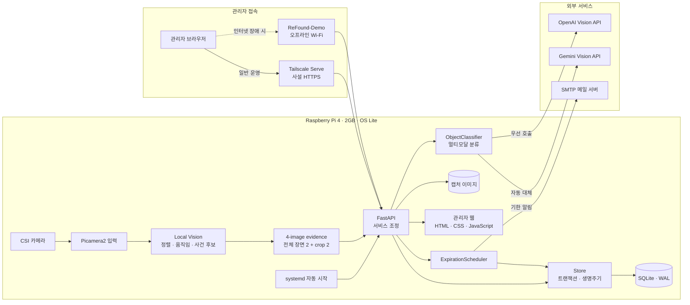
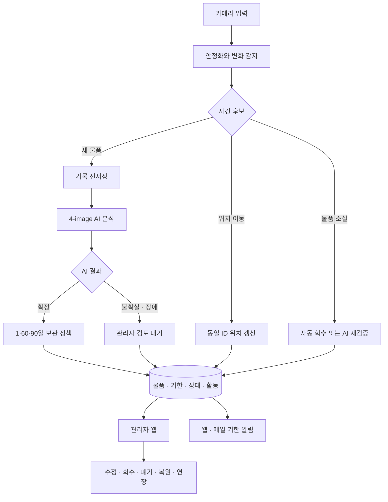
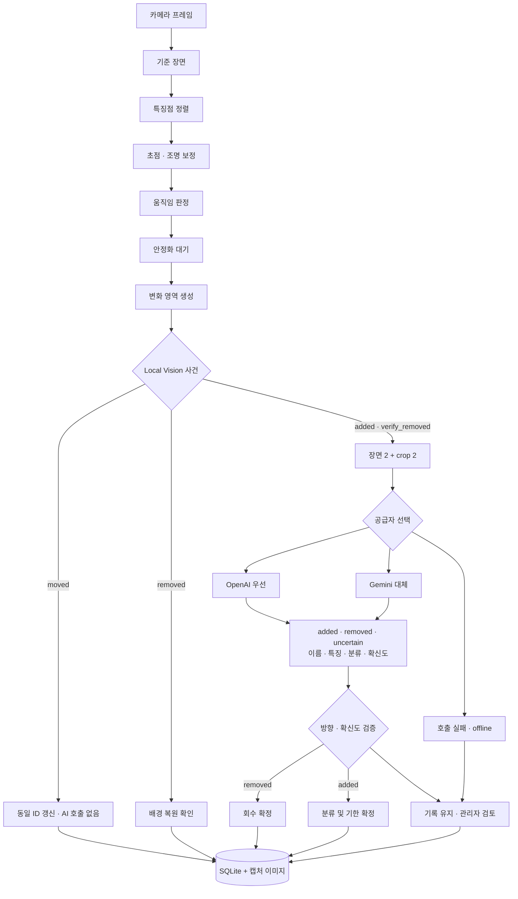
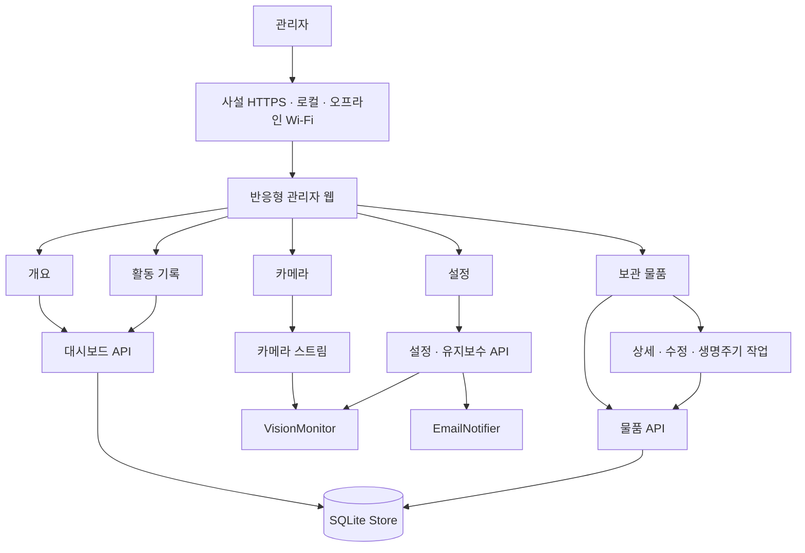
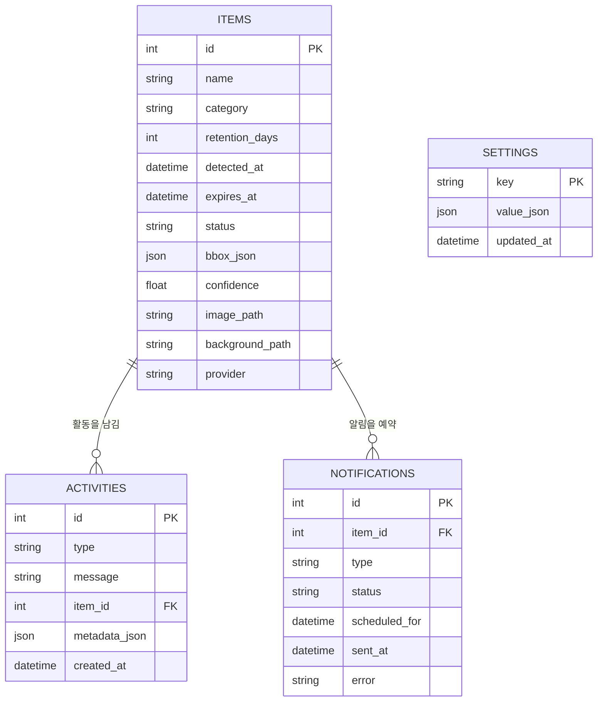

# Re:Found 발표용 다이어그램

## 1. 현재 시스템 구성

```mermaid
flowchart LR
    subgraph PI["Raspberry Pi 4 · 2GB · OS Lite"]
        CAM["CSI 카메라"] --> CAP["Picamera2 입력"]
        BOOT["systemd 자동 시작"] --> API["FastAPI<br/>서비스 조정"]
        CAP --> VISION["Local Vision<br/>정렬 · 움직임 · 사건 후보"]
        VISION --> EVIDENCE["4-image evidence<br/>전체 장면 2 + crop 2"]
        EVIDENCE --> API
        API --> CLASSIFIER["ObjectClassifier<br/>멀티모달 분류"]
        API --> STORE["Store<br/>트랜잭션 · 생명주기"]
        STORE --> DB[("SQLite · WAL")]
        API --> FILES[("캡처 이미지")]
        API --> WEB["관리자 웹<br/>HTML · CSS · JavaScript"]
        API --> SCHEDULER["ExpirationScheduler"]
        SCHEDULER --> STORE
    end
    subgraph EXTERNAL["외부 서비스"]
        OPENAI["OpenAI Vision API"]
        GEMINI["Gemini Vision API"]
        SMTP["SMTP 메일 서버"]
    end
    subgraph ACCESS["관리자 접속"]
        ADMIN["관리자 브라우저"]
        TAILSCALE["Tailscale Serve<br/>사설 HTTPS"]
        HOTSPOT["ReFound-Demo<br/>오프라인 Wi-Fi"]
    end
    CLASSIFIER -->|"우선 호출"| OPENAI
    CLASSIFIER -->|"자동 대체"| GEMINI
    SCHEDULER -->|"기한 알림"| SMTP
    ADMIN -->|"일반 운영"| TAILSCALE --> API
    ADMIN -. "인터넷 장애 시" .-> HOTSPOT --> API
```

## 2. 주요 기능 정의

```mermaid
flowchart TB
    CAMERA["카메라 입력"] --> DETECT["안정화와 변화 감지"] --> EVENT{"사건 후보"}
    EVENT -->|"새 물품"| PROVISIONAL["기록 선저장"] --> AI["4-image AI 분석"] --> RESULT{"AI 결과"}
    RESULT -->|"확정"| POLICY["1·60·90일 보관 정책"]
    RESULT -->|"불확실 · 장애"| REVIEW["관리자 검토 대기"]
    EVENT -->|"위치 이동"| MOVE["동일 ID 위치 갱신"]
    EVENT -->|"물품 소실"| REMOVE["자동 회수 또는 AI 재검증"]
    POLICY --> DATA[("물품 · 기한 · 상태 · 활동")]
    REVIEW --> DATA
    MOVE --> DATA
    REMOVE --> DATA
    DATA --> DASHBOARD["관리자 웹"] --> ACTIONS["수정 · 회수 · 폐기 · 복원 · 연장"]
    DATA --> EXPIRY["웹 · 메일 기한 알림"]
```

## 3. 데이터 및 AI 모델 설계

```mermaid
flowchart TB
    FRAME["카메라 프레임"] --> WARMUP["기준 장면"] --> ALIGN["특징점 정렬"] --> PHOTO["초점 · 조명 보정"]
    PHOTO --> MOTION["움직임 판정"] --> SETTLE["안정화 대기"] --> CHANGE["변화 영역 생성"] --> LOCAL{"Local Vision 사건"}
    LOCAL -->|"moved"| SAMEID["동일 ID 갱신 · AI 호출 없음"]
    LOCAL -->|"removed"| RECOVER["배경 복원 확인"]
    LOCAL -->|"added · verify_removed"| PACK["장면 2 + crop 2"]
    PACK --> SELECT{"공급자 선택"}
    SELECT --> OPENAI["OpenAI 우선"]
    SELECT --> GEMINI["Gemini 대체"]
    SELECT --> OFFLINE["호출 실패 · offline"]
    OPENAI --> JSON["added · removed · uncertain<br/>이름 · 특징 · 분류 · 확신도"]
    GEMINI --> JSON
    JSON --> VALIDATE{"방향 · 확신도 검증"}
    VALIDATE -->|"added"| CONFIRMED["분류 및 기한 확정"]
    VALIDATE -->|"removed"| RECOVERYCONFIRM["회수 확정"]
    VALIDATE --> REVIEW["기록 유지 · 관리자 검토"]
    OFFLINE --> REVIEW
    SAMEID --> SQLITE[("SQLite + 캡처 이미지")]
    RECOVER --> SQLITE
    RECOVERYCONFIRM --> SQLITE
    CONFIRMED --> SQLITE
    REVIEW --> SQLITE
```

## 4. UI/UX 및 서비스 구조

```mermaid
flowchart TB
    ADMIN["관리자"] --> ACCESS["사설 HTTPS · 로컬 · 오프라인 Wi-Fi"] --> SHELL["반응형 관리자 웹"]
    SHELL --> DASH["개요"]
    SHELL --> ITEMS["보관 물품"]
    SHELL --> ACTIVITY["활동 기록"]
    SHELL --> CAMERA["카메라"]
    SHELL --> SETTINGS["설정"]
    ITEMS --> DETAIL["상세 · 수정 · 생명주기 작업"]
    DASH --> DASHAPI["대시보드 API"]
    ACTIVITY --> DASHAPI
    ITEMS --> ITEMAPI["물품 API"]
    DETAIL --> ITEMAPI
    CAMERA --> STREAM["카메라 스트림"]
    SETTINGS --> SETTINGAPI["설정 · 유지보수 API"]
    DASHAPI --> STORE[("SQLite Store")]
    ITEMAPI --> STORE
    STREAM --> VISION["VisionMonitor"]
    SETTINGAPI --> VISION
    SETTINGAPI --> NOTIFIER["EmailNotifier"]
```

## 5. SQLite 데이터 모델

```mermaid
erDiagram
    ITEMS ||--o{ ACTIVITIES : "활동을 남김"
    ITEMS ||--o{ NOTIFICATIONS : "알림을 예약"
    ITEMS {
        int id PK
        string name
        string category
        int retention_days
        datetime detected_at
        datetime expires_at
        string status
        json bbox_json
        float confidence
        string image_path
        string background_path
        string provider
    }
    ACTIVITIES {
        int id PK
        string type
        string message
        int item_id FK
        json metadata_json
        datetime created_at
    }
    NOTIFICATIONS {
        int id PK
        int item_id FK
        string type
        string status
        datetime scheduled_for
        datetime sent_at
        string error
    }
    SETTINGS {
        string key PK
        json value_json
        datetime updated_at
    }
```
